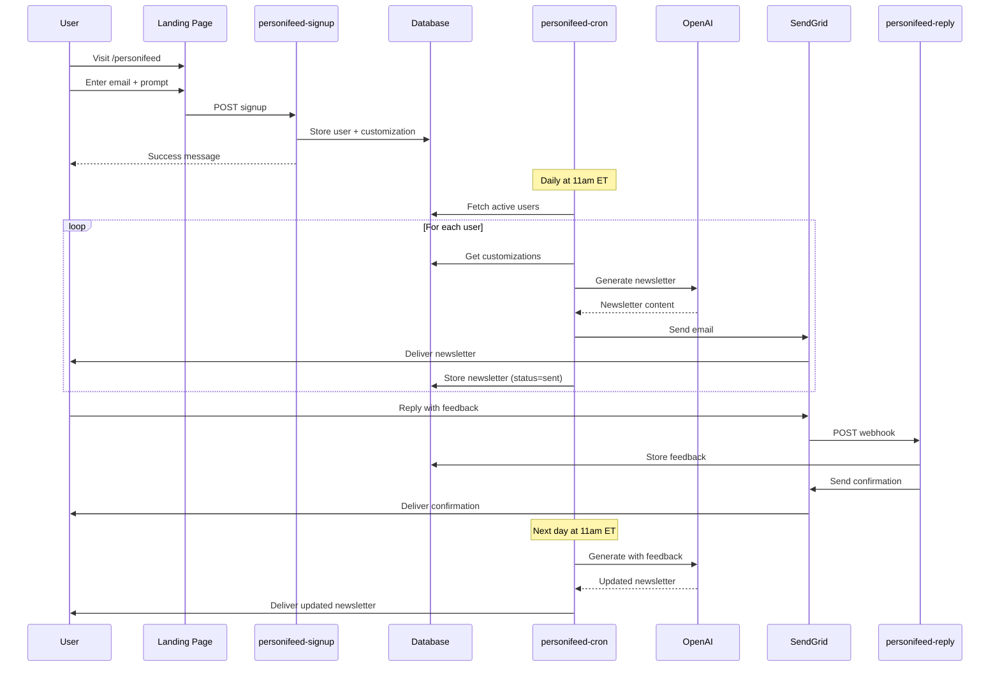

# personi[feed] - AI-Powered Daily Newsletter

> Your personalized daily digest, delivered at 11am ET

**Status:** MVP Complete - In Production **Production URL:** https://llmbox.pro/personifeed **Email
Domain:** mail.llmbox.pro

personi[feed] is a daily AI newsletter service that generates personalized content based on your
interests. Sign up with just an email and a prompt—no password required. Each newsletter is sent
from a unique dynamic address (`reply+{userId}@mail.llmbox.pro`) for efficient reply routing.

## 🎯 Key Features

- **100% Personalized**: Every newsletter tailored to your specific interests
- **Zero Friction**: No password, no login, no app—just email
- **Conversational**: Reply to any newsletter to refine future content
- **Daily Consistency**: Arrives every day at 11am ET
- **Dynamic Reply Addresses**: Each user gets unique reply address for efficient routing

## 🏗️ Architecture

Built on the llmbox foundation with:

- **Backend**: Supabase Edge Functions (Deno + TypeScript)
- **Database**: Supabase PostgreSQL (users, customizations, newsletters)
- **LLM**: OpenAI API (gpt-4o-mini)
- **Email**: SendGrid (inbound + outbound)
- **Web**: Next.js 14 + React + TailwindCSS (deployed to Vercel)
- **Scheduling**: Supabase Cron (daily at 11am ET)

## 📁 Project Structure

```
llmbox/
├── supabase/
│   ├── import_map.json                 # Top-level imports (Supabase standard)
│   ├── config.toml                     # Function configurations
│   ├── functions/
│   │   ├── _shared/                    # Shared utilities (Supabase best practice)
│   │   │   ├── config.ts               # Environment variable access
│   │   │   ├── cors.ts                 # CORS headers
│   │   │   ├── emailSender.ts          # SendGrid integration (dynamic addresses)
│   │   │   ├── errors.ts               # Custom error classes
│   │   │   ├── llmClient.ts            # OpenAI integration
│   │   │   ├── logger.ts               # Structured logging
│   │   │   ├── retryLogic.ts           # Exponential backoff
│   │   │   ├── supabaseClient.ts       # Supabase helpers
│   │   │   └── types.ts                # Shared TypeScript types
│   │   ├── personifeed-signup/         # Signup handler
│   │   │   ├── index.ts
│   │   │   ├── database.ts
│   │   │   └── validation.ts
│   │   ├── personifeed-cron/           # Daily newsletter generator
│   │   │   ├── index.ts
│   │   │   ├── database.ts
│   │   │   └── newsletterGenerator.ts
│   │   ├── personifeed-reply/          # Reply handler
│   │   │   ├── index.ts
│   │   │   ├── database.ts
│   │   │   └── emailParser.ts
│   │   └── tests/                      # Function tests
│   │       ├── personifeed-signup-test.ts
│   │       ├── personifeed-cron-test.ts
│   │       └── personifeed-reply-test.ts
│   └── migrations/
│       └── 20251009000000_personifeed_schema.sql
├── web/
│   └── app/
│       └── personifeed/
│           └── page.tsx                # Landing page
├── tests/
│   └── integration/
│       ├── personifeed-signup.test.ts
│       ├── personifeed-cron.test.ts
│       └── personifeed-reply.test.ts
├── docs/
│   ├── personifeed-prd.md              # Product requirements & deployment
│   └── personifeed-architecture.md     # System architecture & technical details
└── PERSONIFEED-README.md               # This file
```

## 🚀 Quick Start

### Prerequisites

- Node.js 18+
- Deno 1.x
- Supabase CLI
- OpenAI API key
- SendGrid account

### 1. Clone & Install

```bash
git clone [repository-url]
cd llmbox

# Install web dependencies
deno task web:install
```

### 2. Set Up Database

```bash
# Apply migration
deno task db:push
```

### 3. Configure Secrets

```bash
# Set required environment variables
deno task secrets:set:key OPENAI_API_KEY=sk-...
deno task secrets:set:key SENDGRID_API_KEY=SG...
deno task secrets:set:key PERSONIFEED_EMAIL_DOMAIN=mail.llmbox.pro
```

### 4. Deploy Functions

```bash
# Deploy all personifeed functions
deno task deploy:personifeed:all
```

### 5. Configure Cron Job

Set up daily cron trigger in Supabase Dashboard:

- Schedule: `0 15 * * *` (11am ET = 3pm UTC)
- Target: `personifeed-cron` function

### 6. Deploy Web App

```bash
cd web
npm run build
vercel deploy --prod
```

## 🧪 Testing

### Unit Tests

```bash
# Run all personifeed unit tests
deno task test:personifeed
```

### Integration Tests

```bash
# Run all personifeed integration tests (requires API keys)
deno task test:integration:personifeed
```

### Manual Testing

**1. Test Signup Function**

- Navigate to landing page: `https://[your-domain]/personifeed`
- Enter valid email and prompt → Submit
- Verify success message and check database: `SELECT * FROM users WHERE email = '...'`

**2. Test Cron Job Manually**

```bash
deno task trigger:cron
```

- Check response for `"success": true`
- Check email inbox for newsletter
- Verify in database: `SELECT * FROM newsletters WHERE user_id = '...'`

**3. Test Reply Function**

- Reply to newsletter email with feedback
- Check database: `SELECT * FROM customizations WHERE type = 'feedback'`
- Verify confirmation email received

**4. Test Complete User Journey**

- Day 1: Sign up with test email
- Day 2 @ 11am ET: Verify first newsletter received
- Day 2: Reply with feedback → verify confirmation email
- Day 3 @ 11am ET: Verify updated newsletter with feedback incorporated

## 📊 Database Schema

### users

| Column     | Type      | Description                    |
| ---------- | --------- | ------------------------------ |
| id         | UUID      | Primary key                    |
| email      | VARCHAR   | User email (unique)            |
| created_at | TIMESTAMP | Signup timestamp               |
| active     | BOOLEAN   | Newsletter subscription status |

### customizations

| Column     | Type      | Description                         |
| ---------- | --------- | ----------------------------------- |
| id         | UUID      | Primary key                         |
| user_id    | UUID      | Foreign key to users                |
| content    | TEXT      | Prompt or feedback (max 2000 chars) |
| type       | VARCHAR   | 'initial' or 'feedback'             |
| created_at | TIMESTAMP | Creation timestamp                  |

### newsletters

| Column     | Type      | Description                         |
| ---------- | --------- | ----------------------------------- |
| id         | UUID      | Primary key                         |
| user_id    | UUID      | Foreign key to users                |
| content    | TEXT      | Generated newsletter content        |
| sent_at    | TIMESTAMP | Delivery timestamp (null if failed) |
| status     | VARCHAR   | 'pending', 'sent', or 'failed'      |
| created_at | TIMESTAMP | Generation timestamp                |

## 🔄 User Journey



## 🛠️ Development Workflow

### Local Development

```bash
# Start web dev server
deno task web:dev

# Run unit tests in watch mode
deno task test:watch

# Lint and format
deno task lint
deno task fmt
```

### Deploy Changes

```bash
# Deploy functions
deno task deploy:personifeed:all

# Apply database migrations
deno task db:push

# Deploy web app
cd web && vercel deploy --prod
```

## 📋 Available Tasks

```bash
# Deployment
deno task deploy:personifeed:all    # Deploy all functions
deno task db:push                   # Apply database migrations

# Testing
deno task test:personifeed              # Run unit tests
deno task test:integration:personifeed  # Run integration tests

# Development
deno task web:dev                   # Start web dev server
deno task lint                      # Lint code
deno task fmt                       # Format code

# Utilities
deno task secrets:list              # List all secrets
deno task secrets:set:key KEY=value # Set a secret
deno task help                      # Show all tasks
```

## 💰 Cost Estimation

For **100 users/day**:

| Service    | Usage                 | Cost        |
| ---------- | --------------------- | ----------- |
| OpenAI API | ~3,000 requests/month | ~$30/mo     |
| SendGrid   | 3,000 emails/month    | Free        |
| Supabase   | 500MB database        | Free        |
| Vercel     | Static site           | Free        |
| **Total**  |                       | **~$30/mo** |

### Cost Optimization

- Use `gpt-4o-mini` instead of `gpt-4o` (10x cheaper)
- Limit `max_tokens` to 2000 (shorter responses)
- Batch process users (10 at a time) in cron job

## 🔒 Security

- ✅ API keys stored as Supabase secrets
- ✅ JWT verification enabled for cron function
- ✅ Input validation on all user inputs
- ✅ Email format validation
- ✅ Prompt length limits (2000 characters)
- ✅ Database access via service role key
- ✅ CORS headers configured

## 📈 Monitoring

### Key Metrics

- **Signup Rate**: New users per day
- **Delivery Rate**: Successful newsletters / total users
- **Reply Rate**: Feedback customizations per user
- **Error Rate**: Failed operations / total operations

### View Logs

```bash
# View function logs
supabase functions logs personifeed-signup --project-ref [your-ref]
supabase functions logs personifeed-cron --project-ref [your-ref]
supabase functions logs personifeed-reply --project-ref [your-ref]
```

Or use Supabase Dashboard → Edge Functions → Logs

## 🐛 Troubleshooting

### Newsletters not sending

1. Check OpenAI API key is set
2. Verify SendGrid API key is set
3. Check sender email is authenticated
4. Review cron function logs

### Replies not processed

1. Verify SendGrid Inbound Parse is configured
2. Check MX records are correct
3. Test reply function with curl
4. Review reply function logs

### Signup form not working

1. Check browser console for errors
2. Verify CORS headers are set
3. Test signup function directly
4. Review signup function logs

## 📚 Documentation

- **PRD**: `docs/personifeed-prd.md` - Product requirements, deployment guide, quick reference
- **Architecture**: `docs/personifeed-architecture.md` - System design, technical details, dynamic
  reply addresses

## 🗺️ Roadmap

### MVP ✅ Complete - In Production

- ✅ Landing page with signup form at /personifeed
- ✅ Database schema and migrations
- ✅ Daily newsletter generation (11am ET via cron)
- ✅ Email-based customization via replies
- ✅ Dynamic reply addresses (reply+{userId}@domain)
- ✅ Comprehensive testing (unit + integration)
- ✅ Deployed to production (Supabase + Vercel)
- ✅ SendGrid configured with wildcard inbound parse
- ✅ Structured logging and monitoring

### Post-MVP (Planned)

- ⏳ Unsubscribe functionality
- ⏳ Preference management page
- ⏳ Webhook signature verification
- ⏳ Newsletter analytics dashboard
- ⏳ Multiple delivery times
- ⏳ HTML email templates
- ⏳ Newsletter archives

## 📄 License

[Your License]

## 🤝 Contributing

Contributions welcome! Please read the contributing guidelines first.

## 🙏 Acknowledgments

Built on the llmbox foundation, reusing:

- Structured logging
- Retry logic with exponential backoff
- OpenAI integration
- SendGrid email handling
- Next.js web infrastructure

Powered by:

- [Supabase](https://supabase.com/) - Backend platform
- [OpenAI](https://openai.com/) - LLM API
- [SendGrid](https://sendgrid.com/) - Email delivery
- [Vercel](https://vercel.com/) - Web hosting
- [Next.js](https://nextjs.org/) - React framework
- [TailwindCSS](https://tailwindcss.com/) - Styling
