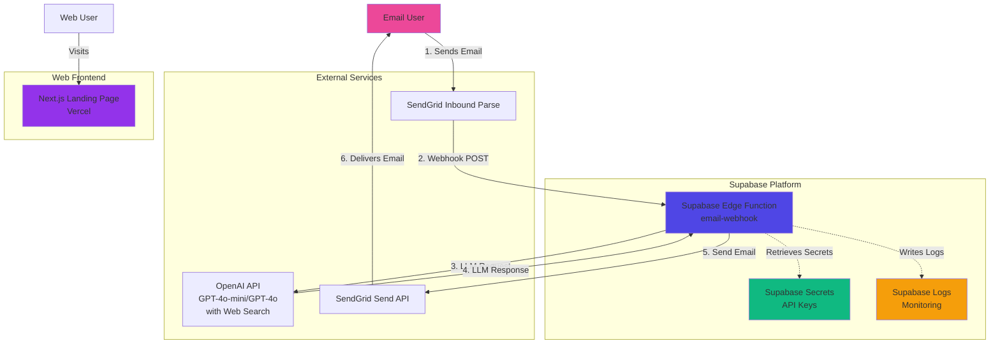
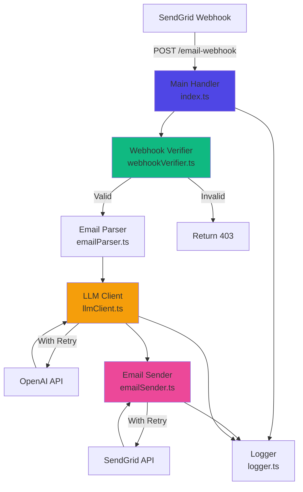
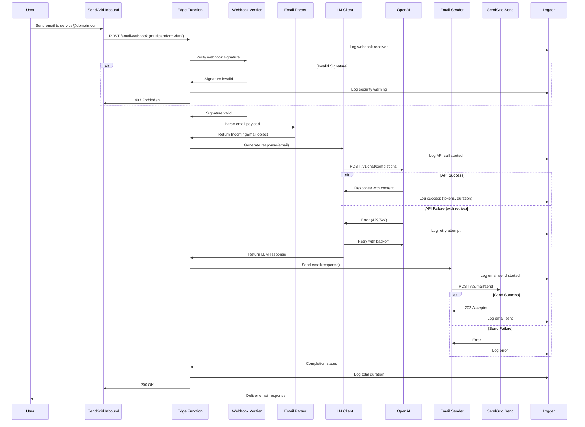
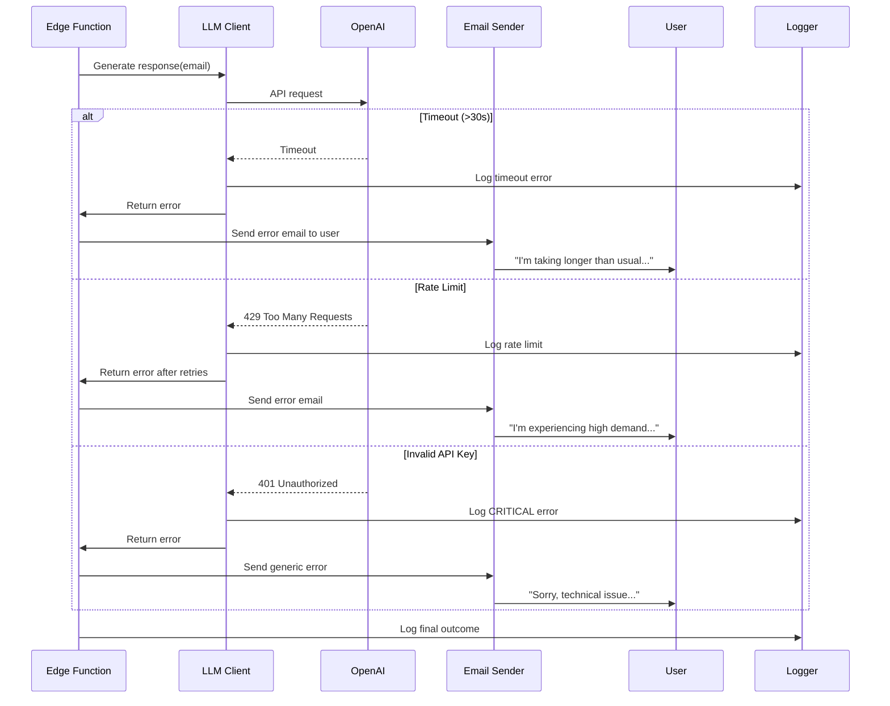

# Email-to-LLM Chat Service Architecture Document

## Introduction

This document outlines the overall project architecture for **Email-to-LLM Chat Service**, including
backend systems, API integrations, and serverless infrastructure. Its primary goal is to serve as
the guiding architectural blueprint for AI-driven development, ensuring consistency and adherence to
chosen patterns and technologies.

### Starter Template or Existing Project

**N/A - Greenfield Project**

This is a new serverless application built from scratch using Supabase Edge Functions. No existing
codebase or starter template is being used.

### Change Log

| Date       | Version | Description                                             | Author              |
| ---------- | ------- | ------------------------------------------------------- | ------------------- |
| 2025-01-07 | 1.0     | Initial Architecture                                    | Architect (Winston) |
| 2025-10-08 | 1.1     | Updated for Epic 1 completion, web search, landing page | System              |

---

## High Level Architecture

### Technical Summary

The Email-to-LLM Chat Service is a **serverless, event-driven architecture** built on Supabase Edge
Functions. The system receives emails via SendGrid's Inbound Parse webhook, processes them through
OpenAI's API (GPT-4o-mini, GPT-4o) with **built-in web search capability** for LLM-generated
responses, and sends replies back via SendGrid's Send API. The architecture is **stateless for
MVP**, with no database persistence, allowing for simple deployment and horizontal scaling. All API
credentials are securely managed through Supabase secrets. The system includes a **Next.js 14
landing page** for user-facing documentation. The design supports the PRD's core goals of rapid MVP
deployment, seamless email integration, and future scalability to add conversation history storage.

**Status:** Epic 1 Complete ✅ - Core email-LLM pipeline fully operational with comprehensive
testing.

### Platform and Infrastructure Choice

**Platform:** Supabase (Edge Functions + Secrets Management)

**Key Services:**

- **Supabase Edge Functions** - Serverless compute (Deno runtime)
- **Supabase Secrets** - Secure API key storage
- **Supabase Logs** - Centralized logging and monitoring

**Deployment Host and Regions:**

- Supabase global edge network (automatic multi-region)
- Functions deployed closest to user requests

**Rationale:**

- **Supabase Edge Functions** chosen for zero-config scaling, generous free tier (500K
  invocations/month), and native TypeScript/Deno support
- **Global edge deployment** reduces latency for email processing
- **Integrated secrets management** eliminates need for separate secret storage service
- **Built-in logging** provides observability without additional tooling
- **Post-MVP ready** - Supabase PostgreSQL available when database is needed

### Repository Structure

**Structure:** Monorepo with simple folder organization

**Package Organization:** Single Edge Function for MVP, organized for future expansion

**Rationale:**

- Monorepo simplifies deployment and version control for small team
- Single function keeps MVP simple while allowing easy addition of functions later
- Standard Supabase project structure ensures compatibility with Supabase CLI

### High Level Architecture Diagram



### Architectural Patterns

- **Serverless Architecture:** Supabase Edge Functions for compute - _Rationale:_ Zero server
  management, automatic scaling, pay-per-use pricing aligns with PRD cost optimization goals

- **Event-Driven Processing:** Webhook-triggered function execution - _Rationale:_ Asynchronous
  email processing fits naturally with event-driven model; enables loose coupling between SendGrid
  and processing logic

- **Stateless Functions:** No persistent state in MVP (in-memory only) - _Rationale:_ Simplifies
  deployment and scaling; each request is independent; prepares for future database integration

- **External API Integration Pattern:** Retry logic with exponential backoff for third-party APIs -
  _Rationale:_ Handles transient failures gracefully; prevents cascade failures from external
  service issues

- **Webhook Security Pattern:** HMAC signature verification for inbound webhooks - _Rationale:_
  Prevents unauthorized webhook calls; protects against replay attacks and malicious requests

---

## Tech Stack

### Technology Stack Table

| Category                | Technology              | Version                   | Purpose                                          | Rationale                                                                                                      |
| ----------------------- | ----------------------- | ------------------------- | ------------------------------------------------ | -------------------------------------------------------------------------------------------------------------- |
| **Frontend**            | Next.js                 | 14.2.15                   | Landing page                                     | Modern React framework, static site generation, Vercel deployment                                              |
| **Frontend**            | React                   | 18.3+                     | UI library                                       | Component-based architecture, industry standard                                                                |
| **Frontend**            | TailwindCSS             | 3.4+                      | Styling                                          | Utility-first CSS, rapid UI development                                                                        |
| **Runtime**             | Deno                    | Latest (Supabase managed) | JavaScript/TypeScript runtime for Edge Functions | Native to Supabase Edge Functions; modern, secure runtime with built-in TypeScript support                     |
| **Language**            | TypeScript              | 5.x                       | Primary development language                     | Type safety for API integrations; reduces runtime errors; excellent tooling support                            |
| **Serverless Platform** | Supabase Edge Functions | Latest                    | Serverless compute hosting                       | Zero-config scaling; generous free tier; integrated with Supabase ecosystem                                    |
| **Email Inbound**       | SendGrid Inbound Parse  | API v3                    | Receive and parse incoming emails                | Industry-standard email parsing; reliable webhook delivery; handles MIME complexity                            |
| **Email Outbound**      | SendGrid Send API       | API v3                    | Send response emails                             | Same provider as inbound (simplified billing); excellent deliverability; supports custom headers for threading |
| **LLM/AI**              | OpenAI API              | GPT-4o-mini, GPT-4o       | AI response generation with web search           | Industry-leading LLM; built-in web search capability; reliable API; cost-effective gpt-4o-mini recommended     |
| **HTTP Client**         | Deno native fetch       | Built-in                  | HTTP requests to external APIs                   | Native to Deno; standards-compliant; no additional dependencies                                                |
| **Secrets Management**  | Supabase Secrets        | Built-in                  | Store API keys securely                          | Integrated with Edge Functions; environment variable injection; no external service needed                     |
| **Logging**             | Supabase Logs           | Built-in                  | Centralized logging and monitoring               | Native integration; queryable logs; no additional setup required                                               |
| **Testing Framework**   | Deno Test               | Built-in                  | Unit and integration testing                     | Native to Deno; no additional dependencies; supports async testing                                             |
| **Deployment**          | Supabase CLI            | Latest                    | Local development and deployment                 | Official tooling; consistent dev/prod parity; simple deployment workflow                                       |
| **Version Control**     | Git                     | 2.x+                      | Source code management                           | Industry standard; integrates with all CI/CD platforms                                                         |
| **CI/CD (Optional)**    | GitHub Actions          | Latest                    | Automated testing and deployment                 | Free for public repos; excellent Supabase integration; widely used                                             |

---

## Data Models

### Email Message (In-Memory Only - MVP)

**Purpose:** Represents an incoming email during processing. Not persisted to database in MVP.

**Key Attributes:**

- `from`: string - Sender email address
- `to`: string - Recipient email address (service address)
- `subject`: string - Email subject line
- `body`: string - Plain text email body
- `messageId`: string - Unique message identifier from email headers
- `inReplyTo`: string | null - Message-ID this email replies to
- `references`: string[] - Chain of message IDs in conversation thread
- `timestamp`: Date - When email was received

**Relationships:**

- None (stateless MVP - no persistence)

**TypeScript Interface:**

```typescript
interface IncomingEmail {
  from: string;
  to: string;
  subject: string;
  body: string;
  messageId: string;
  inReplyTo: string | null;
  references: string[];
  timestamp: Date;
}
```

### LLM Response (In-Memory Only - MVP)

**Purpose:** Represents the generated response from OpenAI API.

**Key Attributes:**

- `content`: string - Generated response text
- `model`: string - Model used (e.g., "gpt-4")
- `tokenCount`: number - Tokens used in generation
- `completionTime`: number - Time taken to generate (milliseconds)

**TypeScript Interface:**

```typescript
interface LLMResponse {
  content: string;
  model: string;
  tokenCount: number;
  completionTime: number;
}
```

### Outgoing Email (In-Memory Only - MVP)

**Purpose:** Represents an email being sent to the user.

**Key Attributes:**

- `from`: string - Service email address
- `to`: string - Recipient (original sender)
- `subject`: string - Email subject (with "Re:" prefix)
- `body`: string - Response content from LLM
- `inReplyTo`: string - Original message ID
- `references`: string[] - Updated thread references

**TypeScript Interface:**

```typescript
interface OutgoingEmail {
  from: string;
  to: string;
  subject: string;
  body: string;
  inReplyTo: string;
  references: string[];
}
```

**Note:** For Post-MVP database integration, these models will be persisted to PostgreSQL tables
with additional fields for user management and conversation history.

---

## Components

### Email Webhook Handler

**Responsibility:** Primary Edge Function that receives SendGrid webhooks, orchestrates LLM
processing, and sends email responses.

**Key Interfaces:**

- HTTP POST endpoint: `/email-webhook` (public, receives SendGrid webhooks)
- Responds with HTTP status codes: 200 (success), 400 (bad request), 401/403 (auth failures)

**Dependencies:**

- External: SendGrid Inbound Parse (webhook source)
- External: OpenAI API (LLM processing)
- External: SendGrid Send API (email delivery)
- Internal: Supabase Secrets (API keys)

**Technology Stack:**

- Deno runtime
- TypeScript
- Native fetch API for HTTP requests
- Crypto module for HMAC verification

**Internal Structure:**

```
email-webhook/
├── index.ts              # Main handler entry point
├── webhookVerifier.ts    # SendGrid signature verification
├── emailParser.ts        # Parse SendGrid payload
├── llmClient.ts          # OpenAI API integration
├── emailSender.ts        # SendGrid Send API integration
├── logger.ts             # Structured logging utilities
├── retryLogic.ts         # Exponential backoff retry handler
└── types.ts              # TypeScript interfaces
```

### Component Diagram



---

## External APIs

### SendGrid Inbound Parse API

- **Purpose:** Receive and parse incoming emails
- **Documentation (ALWAYS USE CONTEXT7 MCP):**
  https://docs.sendgrid.com/for-developers/parsing-email/inbound-email
- **Base URL(s):** Webhook receiver (our Edge Function URL)
- **Authentication:** HMAC signature verification (webhook sends signature in headers)
- **Rate Limits:** No explicit limit (webhook-based, SendGrid controls delivery)

**Key Endpoints Used:**

- N/A (inbound webhook - SendGrid calls our endpoint)

**Integration Notes:**

- Requires MX record configuration pointing to `mx.sendgrid.net`
- Webhook sends multipart/form-data with email content
- Includes headers for email threading (Message-ID, In-Reply-To, References)
- Maximum email size: 30MB
- Must respond with 2xx status within 30 seconds to avoid retry

### SendGrid Send API

- **Purpose:** Send email responses to users
- **Documentation (ALWAYS USE CONTEXT7 MCP):**
  https://docs.sendgrid.com/api-reference/mail-send/mail-send
- **Base URL(s):** `https://api.sendgrid.com/v3/mail/send`
- **Authentication:** Bearer token (API key in Authorization header)
- **Rate Limits:** Varies by plan (free tier: 100 emails/day)

**Key Endpoints Used:**

- `POST /v3/mail/send` - Send email with custom headers

**Integration Notes:**

- Requires verified sender domain
- Supports custom headers for email threading (In-Reply-To, References)
- Returns 202 Accepted on success
- Retry on 5xx errors only
- API key stored in Supabase Secrets as `SENDGRID_API_KEY`

### OpenAI API

- **Purpose:** Generate intelligent email responses using LLM with built-in web search
- **Documentation:** https://platform.openai.com/docs/api-reference/chat
- **Base URL(s):** `https://api.openai.com/v1/chat/completions`
- **Authentication:** Bearer token (API key in Authorization header)
- **Rate Limits:** Varies by tier (usage-based pricing)

**Key Endpoints Used:**

- `POST /v1/chat/completions` - Generate chat completion with optional web search

**Integration Notes:**

- **Models:** `gpt-4o-mini` (recommended, cost-effective) or `gpt-4o` (higher quality)
- **Web Search:** Built-in capability enabled by default via `ENABLE_WEB_SEARCH=true`
- System message: "You are a helpful email assistant. Respond professionally and concisely."
- Max tokens: 1000 (response), 4000 (input)
- Temperature: 0.7
- Timeout: 30 seconds
- Retry on 429 (rate limit) and 5xx errors with exponential backoff
- API key stored in Supabase Secrets as `OPENAI_API_KEY`
- Uses official `@openai/openai` npm library

---

## Core Workflows

### End-to-End Email Processing Flow



### Error Handling Flow



---

## Database Schema

**N/A for MVP - Stateless Architecture**

The MVP does not use a database. All data is processed in-memory during the Edge Function execution
and not persisted.

**Post-MVP Database Design (Future):**

When conversation history is added in post-MVP, the following PostgreSQL schema will be implemented
on Supabase:

```sql
-- Users table (for future multi-user support)
CREATE TABLE users (
  id UUID PRIMARY KEY DEFAULT uuid_generate_v4(),
  email VARCHAR(255) UNIQUE NOT NULL,
  created_at TIMESTAMP WITH TIME ZONE DEFAULT NOW(),
  updated_at TIMESTAMP WITH TIME ZONE DEFAULT NOW()
);

-- Conversations table (email threads)
CREATE TABLE conversations (
  id UUID PRIMARY KEY DEFAULT uuid_generate_v4(),
  user_id UUID REFERENCES users(id),
  subject VARCHAR(500) NOT NULL,
  message_id VARCHAR(500) UNIQUE NOT NULL,
  created_at TIMESTAMP WITH TIME ZONE DEFAULT NOW(),
  updated_at TIMESTAMP WITH TIME ZONE DEFAULT NOW()
);

-- Messages table (individual emails in threads)
CREATE TABLE messages (
  id UUID PRIMARY KEY DEFAULT uuid_generate_v4(),
  conversation_id UUID REFERENCES conversations(id),
  message_id VARCHAR(500) UNIQUE NOT NULL,
  in_reply_to VARCHAR(500),
  direction VARCHAR(20) NOT NULL, -- 'inbound' or 'outbound'
  content TEXT NOT NULL,
  model VARCHAR(50), -- LLM model used (null for inbound)
  token_count INTEGER, -- tokens used (null for inbound)
  created_at TIMESTAMP WITH TIME ZONE DEFAULT NOW()
);

CREATE INDEX idx_conversations_user ON conversations(user_id);
CREATE INDEX idx_messages_conversation ON messages(conversation_id);
CREATE INDEX idx_messages_message_id ON messages(message_id);
```

---

## Source Tree

```plaintext
llmbox/
├── supabase/
│   ├── functions/
│   │   └── email-webhook/
│   │       ├── index.ts              # Main Edge Function handler
│   │       ├── requestHandler.ts     # Request processing logic
│   │       ├── emailParser.ts        # Parse SendGrid webhook payload
│   │       ├── llmClient.ts          # OpenAI API client with web search
│   │       ├── emailSender.ts        # SendGrid Send API client
│   │       ├── logger.ts             # Structured JSON logging
│   │       ├── retryLogic.ts         # Exponential backoff retry handler
│   │       ├── errors.ts             # Custom error types
│   │       ├── errorTemplates.ts     # User-facing error messages
│   │       ├── performance.ts        # Performance monitoring
│   │       ├── performanceMonitor.ts # Performance tracking utilities
│   │       ├── types.ts              # TypeScript interfaces and types
│   │       └── config.ts             # Configuration and env var access
│   └── config.toml                   # Supabase project configuration
├── tests/
│   ├── unit/
│   │   ├── emailParser.test.ts       # Email parsing unit tests
│   │   ├── llmClient.test.ts         # LLM client unit tests
│   │   ├── emailSender.test.ts       # Email sender unit tests
│   │   ├── retryLogic.test.ts        # Retry logic unit tests
│   │   ├── logger.test.ts            # Logger unit tests
│   │   └── errorTemplates.test.ts    # Error template unit tests
│   └── integration/
│       ├── openai.test.ts            # Real OpenAI API tests
│       ├── sendgrid.test.ts          # Real SendGrid API tests
│       ├── end-to-end.test.ts        # Complete workflow tests
│       ├── webhook.test.ts           # Webhook integration tests
│       └── README.md                 # Integration test documentation
├── web/                              # Next.js landing page
│   ├── app/
│   │   ├── layout.tsx                # Root layout with SEO
│   │   ├── page.tsx                  # Main landing page
│   │   └── globals.css               # Global styles
│   ├── components/
│   │   ├── Hero.tsx                  # Hero section
│   │   ├── Features.tsx              # Features grid
│   │   ├── HowItWorks.tsx            # How it works section
│   │   └── CTA.tsx                   # Call-to-action
│   ├── public/                       # Static assets
│   ├── package.json                  # Web dependencies
│   ├── tsconfig.json                 # TypeScript config
│   ├── tailwind.config.ts            # TailwindCSS config
│   ├── next.config.js                # Next.js config
│   └── README.md                     # Web documentation
├── docs/
│   ├── prd.md                        # Product Requirements Document
│   ├── prd/                          # Detailed PRD sections
│   │   ├── epic-1-foundation-core-email-llm-pipeline.md
│   │   ├── epic-2-production-reliability-security.md
│   │   ├── epic-list.md
│   │   ├── goals-and-background-context.md
│   │   ├── index.md
│   │   ├── requirements.md
│   │   └── technical-assumptions.md
│   └── architecture.md               # This document
├── scripts/
│   ├── load-env.sh                   # Environment variable loader
│   └── run-integration-tests.sh      # Integration test runner
├── .cursorrules                      # Cursor IDE coding standards
├── .gitignore                        # Git ignore file
├── deno.json                         # Deno tasks and configuration
├── deno.lock                         # Deno dependency lock file
├── CLAUDE.md                         # Claude AI context
├── WEB-PROJECT-SUMMARY.md            # Web landing page guide
└── README.md                         # Main project documentation
```

**Key Directory Explanations:**

- **`supabase/functions/email-webhook/`** - Single Edge Function containing all core logic (email
  parsing, OpenAI integration, SendGrid sending, error handling, logging)
- **`tests/`** - Comprehensive test coverage with unit tests (fast, no API calls) and integration
  tests (real API calls)
- **`web/`** - Next.js 14 landing page with React + TailwindCSS, deployable to Vercel
- **`docs/`** - All project documentation including PRD and architecture
- **`scripts/`** - Helper scripts for environment loading and test running
- **`.cursorrules`** - Coding standards for Cursor IDE

---

## Infrastructure and Deployment

### Infrastructure as Code

- **Tool:** Supabase CLI + Configuration Files
- **Location:** `supabase/config.toml` and function-specific configs
- **Approach:** Declarative configuration for Edge Functions; secrets managed via Supabase Dashboard
  or CLI

### Deployment Strategy

- **Strategy:** Direct deployment via Supabase CLI
- **CI/CD Platform:** GitHub Actions (optional)
- **Pipeline Configuration:** `.github/workflows/deploy.yml`

**Deployment Commands:**

```bash
# Deploy Edge Function
supabase functions deploy email-webhook

# Set secrets
supabase secrets set SENDGRID_API_KEY=your_key_here
supabase secrets set OPENAI_API_KEY=your_key_here
supabase secrets set SENDGRID_WEBHOOK_VERIFICATION_KEY=your_key_here
```

### Environments

- **Development:** Local development using `supabase functions serve` with `.env.local`
- **Staging:** Dedicated Supabase project for pre-production testing
- **Production:** Production Supabase project with production secrets

### Environment Promotion Flow

```
Local Development
      ↓
   [Manual Testing]
      ↓
Staging (Supabase Project 1)
      ↓
   [Integration Testing]
      ↓
Production (Supabase Project 2)
```

**Promotion Process:**

1. Develop and test locally using `supabase functions serve`
2. Deploy to staging project: `supabase functions deploy --project-ref staging-ref`
3. Run integration tests against staging
4. Deploy to production: `supabase functions deploy --project-ref prod-ref`

### Rollback Strategy

- **Primary Method:** Redeploy previous function version (Supabase maintains version history)
- **Trigger Conditions:**
  - Error rate >10% for 5 minutes
  - Critical errors (invalid API keys, quota exceeded)
  - User reports of failed email delivery
- **Recovery Time Objective:** <5 minutes (time to redeploy previous version)

**Rollback Command:**

```bash
# List versions
supabase functions versions list email-webhook

# Rollback to specific version
supabase functions deploy email-webhook --version <version-id>
```

---

## Error Handling Strategy

### General Approach

- **Error Model:** Structured error objects with type, message, and context
- **Exception Hierarchy:**
  - `WebhookError` - Invalid or unauthorized webhook requests
  - `LLMError` - OpenAI API failures
  - `EmailError` - SendGrid API failures
  - `ValidationError` - Invalid data formats
- **Error Propagation:** Errors logged immediately; user-facing errors sent via email; webhook
  always returns 200 or appropriate HTTP status

### Logging Standards

- **Library:** Deno native `console` with structured JSON formatting
- **Format:** JSON with consistent fields: `timestamp`, `level`, `event`, `context`, `error`
- **Levels:** DEBUG, INFO, WARN, ERROR, CRITICAL
- **Required Context:**
  - **Correlation ID:** Message-ID from email (traces full request lifecycle)
  - **Service Context:** Function name, version, execution time
  - **User Context:** Sender email (anonymized in production logs if needed)

**Log Format Example:**

```typescript
{
  "timestamp": "2025-01-07T10:30:45.123Z",
  "level": "INFO",
  "event": "webhook_received",
  "context": {
    "messageId": "CAF=abc123@mail.gmail.com",
    "from": "user@example.com",
    "subject": "Hello",
    "functionVersion": "1.0"
  }
}
```

### Error Handling Patterns

#### External API Errors

**OpenAI API:**

- **Retry Policy:** 3 attempts with exponential backoff (1s, 2s, 4s)
- **Circuit Breaker:** Not implemented in MVP (stateless - no shared state for circuit breaker)
- **Timeout Configuration:** 30 seconds per request
- **Error Translation:**
  - 429 Rate Limit → Retry, then send user error email
  - 500/502/503/504 → Retry, then send user error email
  - 401/403 → Log CRITICAL, send generic error to user
  - Timeout → Send user error email ("taking longer than usual")

**SendGrid API:**

- **Retry Policy:** Same as OpenAI (3 attempts, exponential backoff)
- **Timeout Configuration:** 10 seconds per request
- **Error Translation:**
  - 429 Rate Limit → Retry, then log error (do not send error email - creates loop)
  - 500/502/503 → Retry, then log error
  - 401/403 → Log CRITICAL error (invalid API key)
  - 400 → Log error with details (malformed request)

#### Business Logic Errors

- **Custom Exceptions:**
  - `InvalidEmailFormatError` - Malformed email payload
  - `MissingRequiredFieldError` - Required email fields missing
  - `SignatureVerificationError` - Invalid webhook signature
- **User-Facing Errors:** All errors result in clear, actionable email responses to user
- **Error Codes:** Not used in MVP (email-based communication doesn't need error codes)

#### Data Consistency

- **Transaction Strategy:** N/A for MVP (stateless, no database)
- **Compensation Logic:** N/A for MVP
- **Idempotency:** Message-ID tracking in-memory (10-minute window) prevents duplicate processing

---

## Coding Standards

### Core Standards

- **Languages & Runtimes:** TypeScript 5.x with strict mode, Deno latest
- **Style & Linting:** Deno fmt (default formatter), Deno lint (default linter)
- **Test Organization:** Tests in `tests/` directory, mirror source structure
- **Documentation:** ALWAYS USE CONTEXT7 MCP

**Configuration:**

```json
// deno.json
{
  "fmt": {
    "options": {
      "lineWidth": 100,
      "indentWidth": 2,
      "singleQuote": true
    }
  },
  "lint": {
    "rules": {
      "tags": ["recommended"]
    }
  }
}
```

### Naming Conventions

| Element               | Convention                            | Example                             |
| --------------------- | ------------------------------------- | ----------------------------------- |
| Files                 | camelCase.ts                          | `emailParser.ts`                    |
| Functions             | camelCase                             | `parseIncomingEmail()`              |
| Classes               | PascalCase                            | `WebhookVerifier`                   |
| Interfaces            | PascalCase with 'I' prefix (optional) | `IncomingEmail` or `IIncomingEmail` |
| Constants             | UPPER_SNAKE_CASE                      | `MAX_RETRY_ATTEMPTS`                |
| Environment Variables | UPPER_SNAKE_CASE                      | `OPENAI_API_KEY`                    |

### Critical Rules

- **Never use console.log in production code** - Use the structured `logger` module instead. Only
  exception: during local development.

- **All API responses must include error context** - When returning error responses, always include
  relevant context (but never expose API keys or sensitive data).

- **All external API calls must use retry logic** - Use the `retryLogic` utility for all OpenAI and
  SendGrid API calls. Never make direct API calls without retry handling.

- **Always validate webhook signatures** - Every webhook request must be verified using
  `webhookVerifier` before processing. Never skip signature verification.

- **Environment variables must use config module** - Access all environment variables through
  `config.ts`. Never use `Deno.env.get()` directly in business logic.

- **All functions must have TypeScript return types** - Never rely on type inference for function
  return values. Always explicitly declare return types.

- **Error objects must include correlation ID** - All logged errors must include the Message-ID for
  request tracing.

---

## Test Strategy and Standards

### Testing Philosophy

- **Approach:** Test-after development for MVP (write tests after implementing features)
- **Coverage Goals:** 80% code coverage for critical paths (webhook verification, API calls, retry
  logic)
- **Test Pyramid:** Heavy emphasis on unit tests (70%), moderate integration tests (25%), minimal
  E2E (5%)

### Test Types and Organization

#### Unit Tests

- **Framework:** Deno Test (built-in)
- **File Convention:** `*.test.ts` co-located with source in `tests/unit/` directory
- **Location:** `tests/unit/`
- **Mocking Library:** Deno standard library mocking utilities

**Coverage Requirement:** 80% for critical modules

**AI Agent Requirements:**

- Generate tests for all public functions
- Cover edge cases and error conditions
- Follow AAA pattern (Arrange, Act, Assert)
- Mock all external dependencies (OpenAI API, SendGrid API)

**Example Test Structure:**

```typescript
import { assertEquals, assertRejects } from 'https://deno.land/std/testing/asserts.ts';
import { parseIncomingEmail } from '../emailParser.ts';

Deno.test('emailParser - parses valid SendGrid payload', () => {
  // Arrange
  const payload = {
    from: 'user@example.com',
    to: 'service@domain.com',
    subject: 'Test',
    text: 'Hello',
    headers: 'Message-ID: <abc123@mail.gmail.com>',
  };

  // Act
  const result = parseIncomingEmail(payload);

  // Assert
  assertEquals(result.from, 'user@example.com');
  assertEquals(result.messageId, '<abc123@mail.gmail.com>');
});
```

#### Integration Tests

- **Scope:** Test interactions between components and real external APIs
- **Location:** `tests/integration/`
- **Test Infrastructure:**
  - **OpenAI API:** Real API calls with test API key (use separate test account)
  - **SendGrid API:** Real API calls with test API key (send to test email addresses)
  - **Webhook:** ngrok or similar tool for local webhook testing

**Example Integration Test:**

```typescript
Deno.test('OpenAI integration - generates response', async () => {
  const client = new LLMClient(Deno.env.get('OPENAI_TEST_API_KEY')!);

  const response = await client.generateResponse({
    from: 'test@example.com',
    subject: 'Test',
    body: 'Hello, how are you?',
  });

  assert(response.content.length > 0);
  assert(response.model.includes('gpt'));
});
```

#### End-to-End Tests

- **Scope:** Full email flow from SendGrid webhook to email delivery
- **Environment:** Staging environment with real services
- **Test Data:** Test email accounts and known input/output pairs

**Manual E2E Test Process:**

1. Send email to staging service address
2. Verify webhook received in Supabase logs
3. Verify OpenAI API call in logs
4. Verify response email received in test inbox
5. Verify email threading (In-Reply-To headers)

### Test Data Management

- **Strategy:** In-memory test data fixtures; no persistent test database needed
- **Fixtures:** TypeScript objects in `tests/fixtures/` directory
- **Factories:** Test data builder functions for creating complex test objects
- **Cleanup:** N/A for MVP (stateless, no database)

**Example Fixture:**

```typescript
// tests/fixtures/emailFixtures.ts
export const validIncomingEmail = {
  from: 'user@example.com',
  to: 'service@domain.com',
  subject: 'Test Subject',
  body: 'Test email body',
  messageId: '<test123@mail.gmail.com>',
  inReplyTo: null,
  references: [],
  timestamp: new Date('2025-01-07T10:00:00Z'),
};
```

### Continuous Testing

- **CI Integration:** GitHub Actions runs tests on every push and pull request
- **Performance Tests:** Monitor Edge Function execution time (target: <30s total)
- **Security Tests:** No automated security testing in MVP; manual security review before production

**GitHub Actions Workflow:**

```yaml
# .github/workflows/test.yml
name: Test
on: [push, pull_request]
jobs:
  test:
    runs-on: ubuntu-latest
    steps:
      - uses: actions/checkout@v3
      - uses: denoland/setup-deno@v1
      - run: deno test --allow-all --coverage=coverage
      - run: deno coverage coverage --lcov > coverage.lcov
```

---

## Security

### Input Validation

- **Validation Library:** Deno standard library + custom validation functions
- **Validation Location:** At API boundary (webhook entry point) before any processing
- **Required Rules:**
  - All external inputs MUST be validated against expected schema
  - Validation at webhook entry point using `emailParser` module
  - Whitelist approach: Only accept known fields from SendGrid payload
  - Reject requests with missing required fields (from, to, subject, text, headers)
  - Validate email addresses using regex pattern
  - Validate Message-ID format

### Authentication & Authorization

- **Auth Method:** HMAC SHA-256 signature verification for SendGrid webhooks
- **Session Management:** N/A (stateless, no user sessions)
- **Required Patterns:**
  - MUST verify SendGrid webhook signature on every request using `webhookVerifier`
  - Use constant-time comparison for signature verification (prevents timing attacks)
  - Reject requests with missing or invalid `X-Twilio-Email-Event-Webhook-Signature` header
  - Validate timestamp to prevent replay attacks (reject requests >10 minutes old)
  - Never process webhooks without successful signature verification

### Secrets Management

- **Development:** `.env.local` file (gitignored) for local development
- **Production:** Supabase Secrets via CLI or Dashboard
- **Code Requirements:**
  - NEVER hardcode secrets in source code
  - Access secrets only via `config.ts` module which reads from `Deno.env`
  - No secrets in logs or error messages
  - Secrets must be set before deployment:
    - `SENDGRID_API_KEY`
    - `OPENAI_API_KEY`
    - `SENDGRID_WEBHOOK_VERIFICATION_KEY`
    - `SERVICE_EMAIL_ADDRESS` (from address for outbound emails)

### API Security

- **Rate Limiting:** Not implemented in MVP (rely on Supabase Edge Functions automatic scaling and
  OpenAI/SendGrid rate limits)
- **CORS Policy:** Not applicable (webhook endpoint, not browser-based)
- **Security Headers:** Automatic via Supabase Edge Functions platform
- **HTTPS Enforcement:** Automatic via Supabase (all Edge Functions are HTTPS-only)

### Data Protection

- **Encryption at Rest:** N/A for MVP (no data persistence)
- **Encryption in Transit:** All API calls use HTTPS (OpenAI, SendGrid, Supabase)
- **PII Handling:**
  - Email addresses considered PII
  - Never log full email bodies (log body preview only: first 100 characters)
  - Email content not persisted in MVP
- **Logging Restrictions:**
  - Never log API keys
  - Never log full email bodies
  - Never log SendGrid webhook verification keys
  - Log sender email addresses but consider anonymization for production

### Dependency Security

- **Scanning Tool:** `deno info` for dependency inspection; GitHub Dependabot for dependency alerts
- **Update Policy:** Review and update dependencies monthly; immediate updates for critical security
  vulnerabilities
- **Approval Process:** All new dependencies must be reviewed for security and licensing; prefer
  Deno standard library over third-party dependencies

### Security Testing

- **SAST Tool:** Deno lint for static analysis
- **DAST Tool:** None in MVP (manual security review)
- **Penetration Testing:** Not planned for MVP; recommended for production post-MVP
