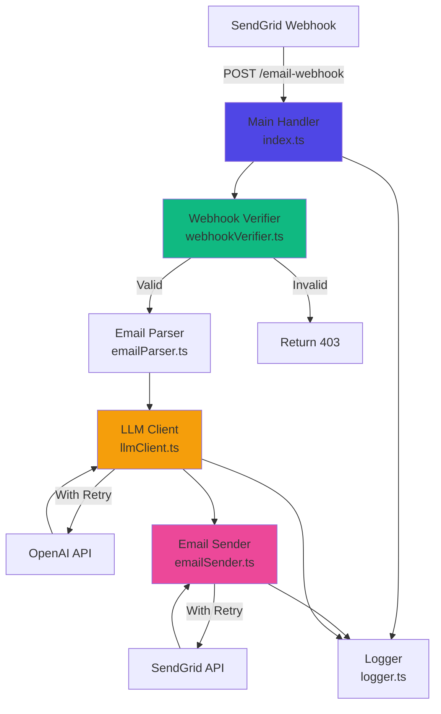

# Components

## Email Webhook Handler

**Responsibility:** Primary Edge Function that receives SendGrid webhooks, orchestrates LLM processing, and sends email responses.

**Key Interfaces:**
- HTTP POST endpoint: `/email-webhook` (public, receives SendGrid webhooks)
- Responds with HTTP status codes: 200 (success), 400 (bad request), 401/403 (auth failures)

**Dependencies:**
- External: SendGrid Inbound Parse (webhook source)
- External: OpenAI API (LLM processing)
- External: SendGrid Send API (email delivery)
- Internal: Supabase Secrets (API keys)

**Technology Stack:**
- Deno runtime
- TypeScript
- Native fetch API for HTTP requests
- Crypto module for HMAC verification

**Internal Structure:**
```
email-webhook/
├── index.ts              # Main handler entry point
├── webhookVerifier.ts    # SendGrid signature verification
├── emailParser.ts        # Parse SendGrid payload
├── llmClient.ts          # OpenAI API integration
├── emailSender.ts        # SendGrid Send API integration
├── logger.ts             # Structured logging utilities
├── retryLogic.ts         # Exponential backoff retry handler
└── types.ts              # TypeScript interfaces
```

## Component Diagram



---
