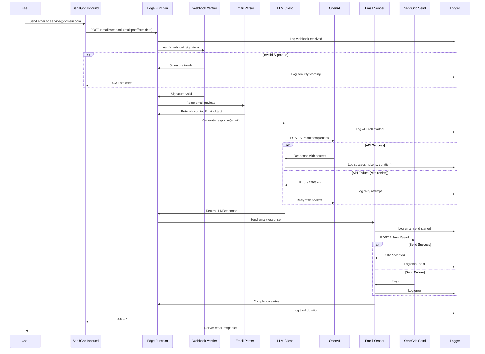
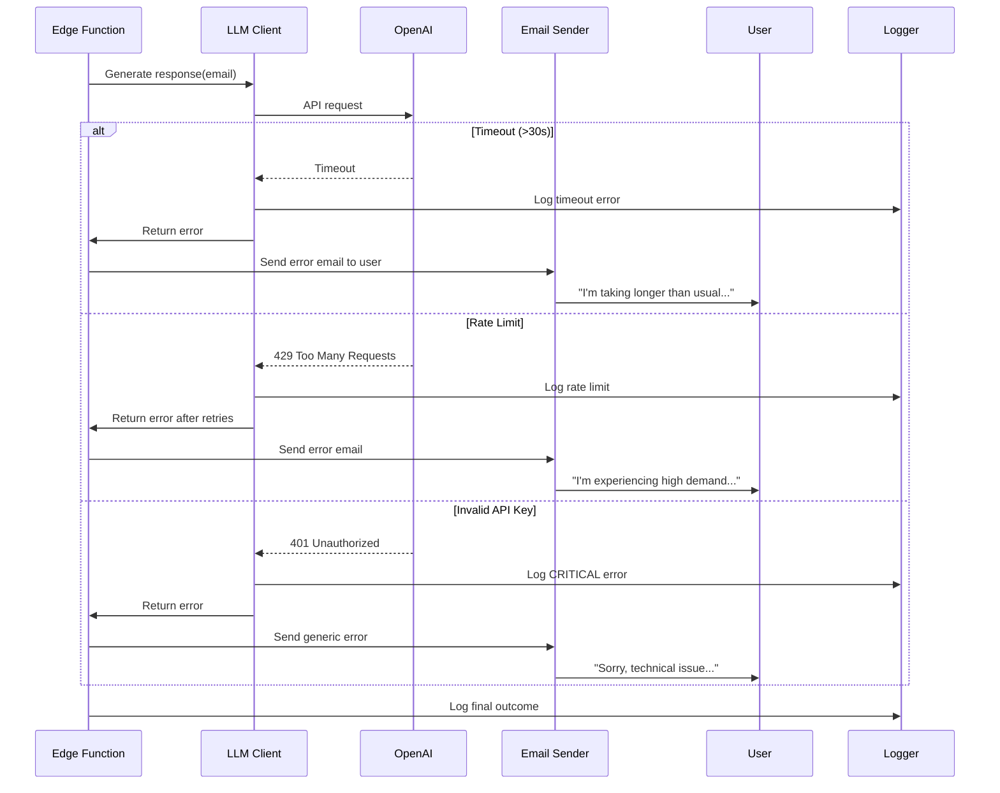

# Core Workflows

## End-to-End Email Processing Flow

```mermaid
sequenceDiagram
    participant User
    participant SendGrid_In as SendGrid Inbound
    participant EdgeFunc as Edge Function
    participant Verifier as Webhook Verifier
    participant Parser as Email Parser
    participant LLM as LLM Client
    participant OpenAI
    participant Sender as Email Sender
    participant SendGrid_Out as SendGrid Send
    participant Logger

    User->>SendGrid_In: Send email to service@domain.com
    SendGrid_In->>EdgeFunc: POST /email-webhook (multipart/form-data)
    EdgeFunc->>Logger: Log webhook received

    EdgeFunc->>Verifier: Verify webhook signature
    alt Invalid Signature
        Verifier->>EdgeFunc: Signature invalid
        EdgeFunc->>Logger: Log security warning
        EdgeFunc->>SendGrid_In: 403 Forbidden
    end

    Verifier->>EdgeFunc: Signature valid
    EdgeFunc->>Parser: Parse email payload
    Parser->>EdgeFunc: Return IncomingEmail object

    EdgeFunc->>LLM: Generate response(email)
    LLM->>Logger: Log API call started
    LLM->>OpenAI: POST /v1/chat/completions

    alt API Success
        OpenAI->>LLM: Response with content
        LLM->>Logger: Log success (tokens, duration)
    else API Failure (with retries)
        OpenAI->>LLM: Error (429/5xx)
        LLM->>Logger: Log retry attempt
        LLM->>OpenAI: Retry with backoff
    end

    LLM->>EdgeFunc: Return LLMResponse

    EdgeFunc->>Sender: Send email(response)
    Sender->>Logger: Log email send started
    Sender->>SendGrid_Out: POST /v3/mail/send

    alt Send Success
        SendGrid_Out->>Sender: 202 Accepted
        Sender->>Logger: Log email sent
    else Send Failure
        SendGrid_Out->>Sender: Error
        Sender->>Logger: Log error
    end

    Sender->>EdgeFunc: Completion status
    EdgeFunc->>Logger: Log total duration
    EdgeFunc->>SendGrid_In: 200 OK

    SendGrid_Out->>User: Deliver email response
```

## Error Handling Flow

```mermaid
sequenceDiagram
    participant EdgeFunc as Edge Function
    participant LLM as LLM Client
    participant OpenAI
    participant Sender as Email Sender
    participant User
    participant Logger

    EdgeFunc->>LLM: Generate response(email)
    LLM->>OpenAI: API request

    alt Timeout (>30s)
        OpenAI-->>LLM: Timeout
        LLM->>Logger: Log timeout error
        LLM->>EdgeFunc: Return error
        EdgeFunc->>Sender: Send error email to user
        Sender->>User: "I'm taking longer than usual..."
    else Rate Limit
        OpenAI-->>LLM: 429 Too Many Requests
        LLM->>Logger: Log rate limit
        LLM->>EdgeFunc: Return error after retries
        EdgeFunc->>Sender: Send error email
        Sender->>User: "I'm experiencing high demand..."
    else Invalid API Key
        OpenAI-->>LLM: 401 Unauthorized
        LLM->>Logger: Log CRITICAL error
        LLM->>EdgeFunc: Return error
        EdgeFunc->>Sender: Send generic error
        Sender->>User: "Sorry, technical issue..."
    end

    EdgeFunc->>Logger: Log final outcome
```

---
