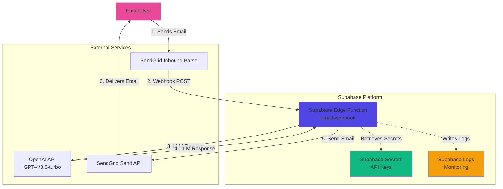

# High Level Architecture

## Technical Summary

The Email-to-LLM Chat Service is a **serverless, event-driven architecture** built on Supabase Edge Functions. The system receives emails via SendGrid's Inbound Parse webhook, processes them through OpenAI's API for LLM-generated responses, and sends replies back via SendGrid's Send API. The architecture is **stateless for MVP**, with no database persistence, allowing for simple deployment and horizontal scaling. All API credentials are securely managed through Supabase secrets. The design supports the PRD's core goals of rapid MVP deployment, seamless email integration, and future scalability to add conversation history storage.

## Platform and Infrastructure Choice

**Platform:** Supabase (Edge Functions + Secrets Management)

**Key Services:**
- **Supabase Edge Functions** - Serverless compute (Deno runtime)
- **Supabase Secrets** - Secure API key storage
- **Supabase Logs** - Centralized logging and monitoring

**Deployment Host and Regions:**
- Supabase global edge network (automatic multi-region)
- Functions deployed closest to user requests

**Rationale:**
- **Supabase Edge Functions** chosen for zero-config scaling, generous free tier (500K invocations/month), and native TypeScript/Deno support
- **Global edge deployment** reduces latency for email processing
- **Integrated secrets management** eliminates need for separate secret storage service
- **Built-in logging** provides observability without additional tooling
- **Post-MVP ready** - Supabase PostgreSQL available when database is needed

## Repository Structure

**Structure:** Monorepo with simple folder organization

**Package Organization:** Single Edge Function for MVP, organized for future expansion

**Rationale:**
- Monorepo simplifies deployment and version control for small team
- Single function keeps MVP simple while allowing easy addition of functions later
- Standard Supabase project structure ensures compatibility with Supabase CLI

## High Level Architecture Diagram

## Architectural Patterns

- **Serverless Architecture:** Supabase Edge Functions for compute - _Rationale:_ Zero server management, automatic scaling, pay-per-use pricing aligns with PRD cost optimization goals

- **Event-Driven Processing:** Webhook-triggered function execution - _Rationale:_ Asynchronous email processing fits naturally with event-driven model; enables loose coupling between SendGrid and processing logic

- **Stateless Functions:** No persistent state in MVP (in-memory only) - _Rationale:_ Simplifies deployment and scaling; each request is independent; prepares for future database integration

- **External API Integration Pattern:** Retry logic with exponential backoff for third-party APIs - _Rationale:_ Handles transient failures gracefully; prevents cascade failures from external service issues

- **Webhook Security Pattern:** HMAC signature verification for inbound webhooks - _Rationale:_ Prevents unauthorized webhook calls; protects against replay attacks and malicious requests

---
