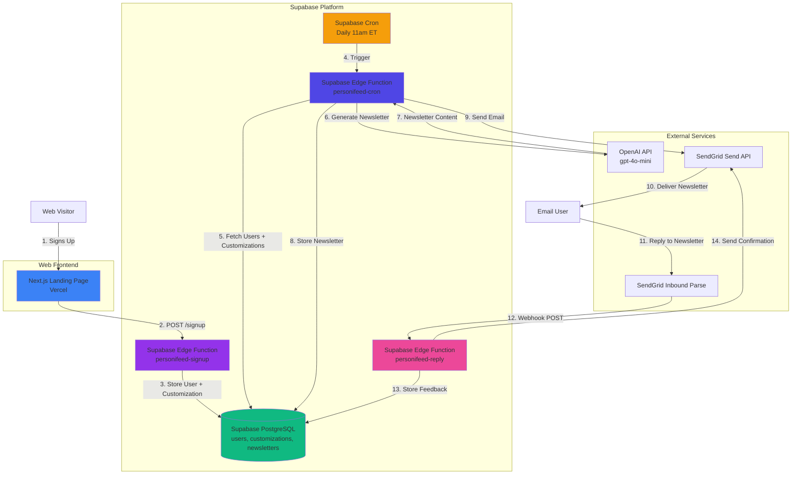
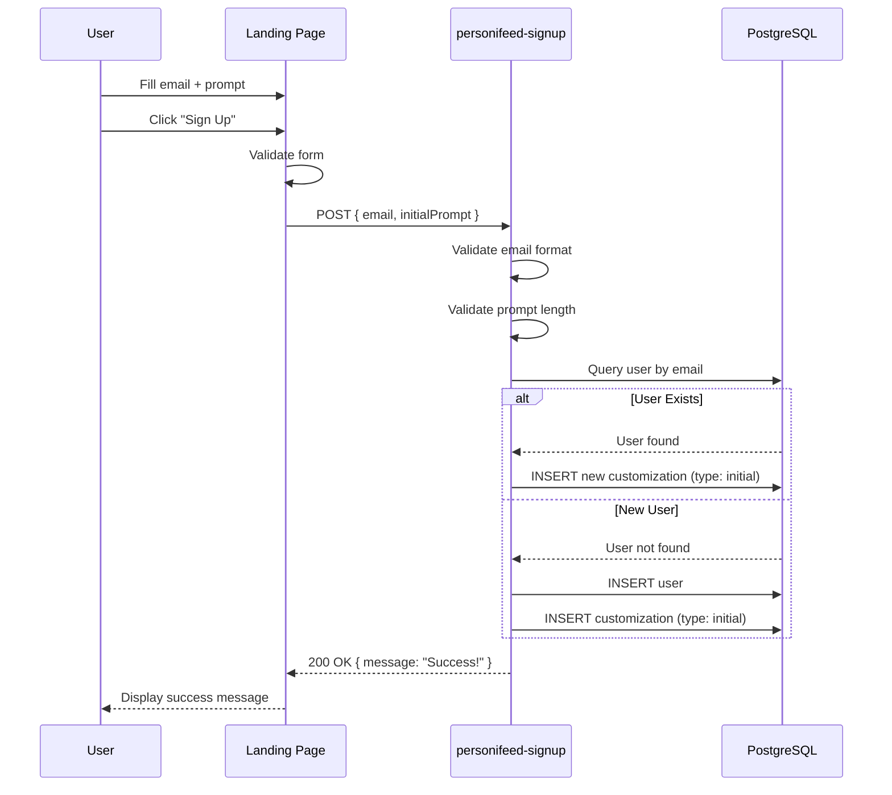
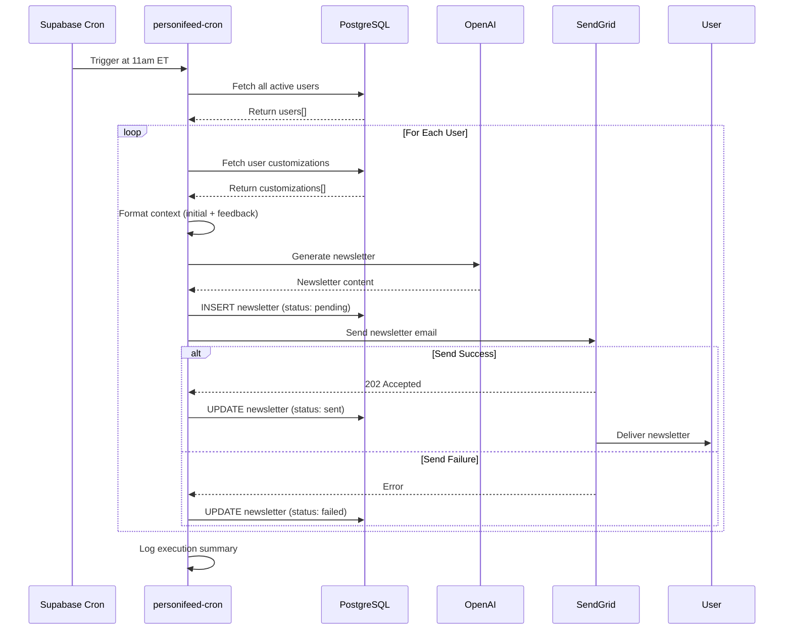
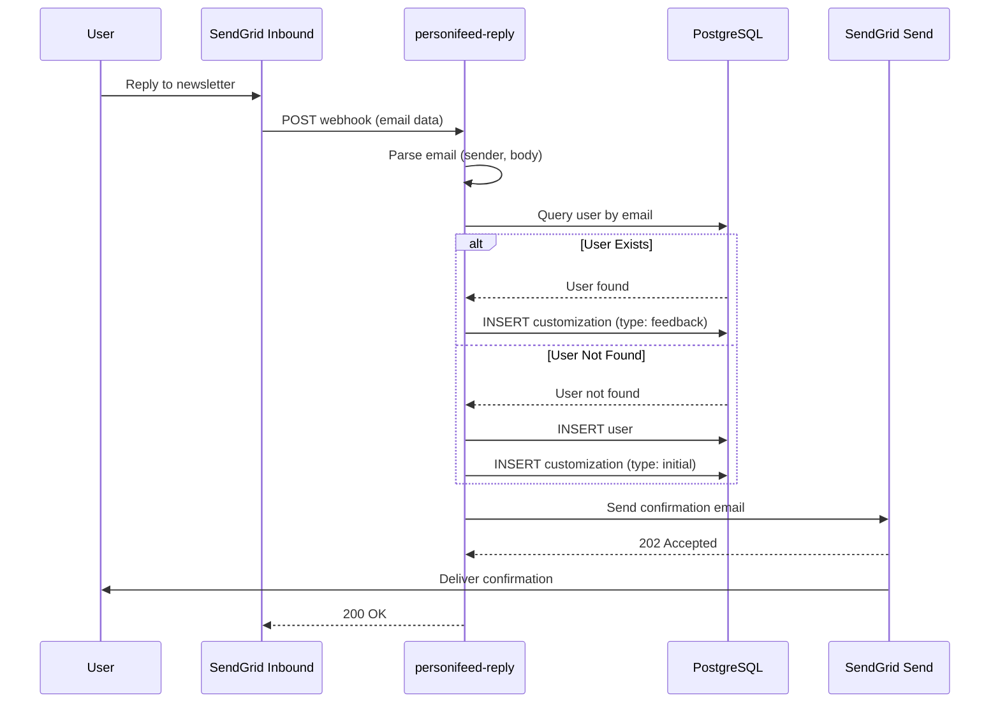

# personi[feed] - Architecture Document

## Introduction

This document outlines the overall project architecture for **personi[feed]**, a daily AI-powered personalized newsletter service. The architecture leverages significant code reuse from the existing **llmbox** project while introducing database persistence and scheduled execution patterns.

### Relationship to Existing Project

**Built on llmbox Foundation**

personi[feed] is developed within the same monorepo as llmbox and extensively reuses battle-tested components including OpenAI integration, SendGrid email handling, structured logging, retry logic, and Next.js web infrastructure. This approach dramatically reduces development time and ensures reliability.

**Key Architectural Differences:**
- **Persistence**: Database-backed (Supabase PostgreSQL) vs. stateless
- **Trigger**: Cron-scheduled vs. webhook-triggered
- **Use Case**: Newsletter generation vs. conversational AI
- **User Model**: Subscription-based vs. ad-hoc email interactions

### Change Log

| Date | Version | Description | Author |
|------|---------|-------------|--------|
| 2025-10-09 | 1.1 | Updated to follow Supabase Edge Functions best practices (_shared folder, co-located tests, import_map.json, config.toml) | Architect |
| 2025-10-09 | 1.0 | Initial Architecture | Architect |

---

## High Level Architecture

### Technical Summary

personi[feed] is a **database-backed, cron-scheduled newsletter service** built on Supabase Edge Functions and PostgreSQL. The system allows users to sign up via a Next.js landing page by providing an email address and initial content preferences. A daily cron job (11am ET) fetches all active users, generates personalized newsletters using OpenAI's API, and delivers them via SendGrid. Users can reply to any newsletter to refine future content, with replies parsed via SendGrid Inbound Parse webhook and stored as feedback in the database. The architecture extensively reuses llmbox components for OpenAI integration, email handling, logging, and retry logic, while adding database persistence, scheduled execution, and a custom newsletter generation workflow.

**Status:** PRD Complete - Ready for Development

### Platform and Infrastructure Choice

**Platform:** Supabase (Edge Functions + PostgreSQL + Cron) + Vercel (Web Hosting)

**Key Services:**
- **Supabase Edge Functions** - Serverless compute (Deno runtime)
- **Supabase PostgreSQL** - User preferences, customizations, newsletter history
- **Supabase Cron** - Daily scheduled newsletter generation (11am ET)
- **Supabase Secrets** - Secure API key storage
- **Vercel** - Next.js landing page hosting

**Deployment Host and Regions:**
- Supabase global edge network (automatic multi-region)
- Vercel global CDN for landing page

**Rationale:**
- **Supabase PostgreSQL** provides reliable, scalable database with generous free tier (500MB)
- **Supabase Cron** offers native scheduled job execution without external services
- **Reuse llmbox Supabase project** reduces operational complexity (or create separate project for isolation)
- **Vercel** provides zero-config Next.js hosting with excellent performance
- **Cost-effective** for MVP scale (100 users fits comfortably in free tiers)

### Repository Structure

**Structure:** Monorepo (shared with llmbox)

**Package Organization:**
```
llmbox/  (repository root)
├── supabase/
│   ├── functions/
│   │   ├── import_map.json              # Top-level import map (shared)
│   │   ├── _shared/                     # Shared utilities (Supabase best practice)
│   │   │   ├── logger.ts
│   │   │   ├── retryLogic.ts
│   │   │   ├── config.ts
│   │   │   ├── errors.ts
│   │   │   ├── types.ts
│   │   │   └── cors.ts
│   │   ├── email-webhook/               # llmbox functions
│   │   ├── personifeed-signup/          # personi[feed] signup
│   │   ├── personifeed-cron/            # personi[feed] daily generation
│   │   ├── personifeed-reply/           # personi[feed] reply handler
│   │   └── tests/                       # Function tests (Supabase best practice)
│   │       ├── personifeed-signup-test.ts
│   │       ├── personifeed-cron-test.ts
│   │       └── personifeed-reply-test.ts
│   ├── migrations/
│   │   └── YYYYMMDDHHMMSS_personifeed_schema.sql
│   └── config.toml
├── web/                          # llmbox landing page
├── web-personifeed/              # personi[feed] landing page
├── tests/
│   ├── unit/                     # Unit tests (for non-function code)
│   └── integration/              # Integration tests
└── docs/
    ├── personifeed-prd.md        # This project's PRD
    └── personifeed-architecture.md  # This document
```

**Rationale:**
- **`_shared/` folder prefix**: Following Supabase best practice for shared code across functions
- **Co-located tests**: Tests placed near functions with `-test` suffix as recommended
- **Top-level `import_map.json`**: Centralized dependency management for all functions
- **Monorepo structure**: Enables code reuse and shared tooling
- **"Fat functions"**: Each function handles complete workflows rather than many small functions
- **Separate Edge Functions**: Maintain clear boundaries while sharing common utilities

### High Level Architecture Diagram



### Architectural Patterns

- **Scheduled Execution Pattern:** Supabase Cron triggers daily newsletter generation - _Rationale:_ Ensures consistent delivery time; decouples generation from user actions; allows batch processing for efficiency

- **Database-Backed Personalization:** User preferences and feedback stored in PostgreSQL - _Rationale:_ Enables cumulative customization over time; supports querying and analytics; prepares for future features

- **Event-Driven Reply Handling:** Webhook-triggered feedback processing - _Rationale:_ Immediate acknowledgment of user feedback; asynchronous processing; reuses llmbox webhook pattern

- **Code Reuse Architecture:** Shared utilities and components across projects - _Rationale:_ Reduces development time; maintains consistency; leverages battle-tested code; simplifies maintenance

- **Separation of Concerns:** Distinct Edge Functions for signup, generation, and replies - _Rationale:_ Independent deployment and scaling; clear responsibilities; easier testing and debugging

### Supabase Edge Functions Best Practices

Following [Supabase Edge Functions Development Tips](https://supabase.com/docs/guides/functions/development-tips), this architecture incorporates:

**1. Organizing Functions:**
- ✅ **Underscore-prefixed shared folder** (`_shared/`) for utilities used across functions
- ✅ **"Fat functions" pattern** - few large functions with complete workflows vs. many small functions
- ✅ **Hyphenated function names** - URL-friendly naming (e.g., `personifeed-signup`, not `personifeedSignup`)
- ✅ **Co-located tests** - tests placed in `supabase/functions/tests/` with `-test` suffix

**2. Configuration:**
- ✅ **Function-specific `config.toml`** - JWT verification and import map location per function
- ✅ **Top-level `import_map.json`** - centralized dependency management for all functions
- ✅ **Explicit JWT settings** - `verify_jwt = false` for public webhooks, `true` for protected endpoints

**3. Error Handling:**
- ✅ **Supabase-js error types** - Use `FunctionsHttpError`, `FunctionsRelayError`, `FunctionsFetchError`
- ✅ **Structured error responses** - Consistent JSON error format across all functions

**4. Database vs Edge Functions:**
- ✅ **Edge Functions for low-latency** - Newsletter generation, signup processing, reply handling
- 🔮 **Database Functions for data-intensive ops** (post-MVP) - Complex data aggregations, bulk operations

**5. HTTP Methods:**
- ✅ Support multiple HTTP methods (`GET`, `POST`, `PUT`, `DELETE`) where appropriate
- ⚠️ **No HTML responses** - HTML content in GET requests is not supported; use JSON or plain text

**6. CORS Support:**
- ✅ Reusable CORS headers in `_shared/cors.ts` for browser-invoked functions
- ✅ Signup function will include CORS headers for web form submissions

---

## Tech Stack

### Technology Stack Table

| Category | Technology | Version | Purpose | Rationale |
|----------|-----------|---------|---------|-----------|
| **Frontend** | Next.js | 14.2.15 | Landing page | Modern React framework, static generation, reuses llmbox setup |
| **Frontend** | React | 18.3+ | UI library | Component-based architecture, industry standard |
| **Frontend** | TailwindCSS | 3.4+ | Styling | Utility-first CSS, consistent with llmbox web app |
| **Runtime** | Deno | Latest (Supabase managed) | Edge Functions runtime | Native to Supabase; TypeScript support; reuses llmbox runtime |
| **Language** | TypeScript | 5.x | Primary development language | Type safety; reduces runtime errors; consistent with llmbox |
| **Database** | Supabase PostgreSQL | 15+ | User preferences, newsletter history | Reliable, scalable, generous free tier, integrated with Supabase |
| **Serverless Platform** | Supabase Edge Functions | Latest | Serverless compute | Zero-config scaling; integrated with database and cron |
| **Scheduling** | Supabase Cron | Latest | Daily newsletter trigger | Native cron support; reliable execution; no external scheduler needed |
| **Email Inbound** | SendGrid Inbound Parse | API v3 | Receive reply emails | **Reused from llmbox**; proven reliability |
| **Email Outbound** | SendGrid Send API | API v3 | Send newsletters and confirmations | **Reused from llmbox**; excellent deliverability |
| **LLM/AI** | OpenAI API | GPT-4o-mini, GPT-4o | Newsletter generation | **Reused from llmbox**; industry-leading; cost-effective |
| **HTTP Client** | Deno native fetch | Built-in | HTTP requests | **Reused from llmbox**; standards-compliant |
| **Secrets Management** | Supabase Secrets | Built-in | Store API keys | **Reused from llmbox**; secure environment variables |
| **Logging** | Supabase Logs | Built-in | Centralized logging | **Reused from llmbox**; queryable logs |
| **Testing Framework** | Deno Test | Built-in | Unit and integration testing | **Reused from llmbox**; no additional dependencies |
| **Deployment** | Supabase CLI + Vercel CLI | Latest | Local development and deployment | **Reused from llmbox**; consistent workflows |

---

## Code Reuse from llmbox

### Overview

personi[feed] leverages approximately **60-70% of llmbox's codebase**, significantly reducing development time from weeks to days. The following sections detail what is reused, what is adapted, and what is built new.

### Directly Reusable Components (No/Minor Changes)

#### 1. Structured Logging (`logger.ts`)
**Location:** `supabase/functions/email-webhook/logger.ts` → `supabase/functions/_shared/logger.ts`

**Reuse:** 100% - No changes required

**Purpose:** Structured JSON logging with correlation IDs, log levels (DEBUG, INFO, WARN, ERROR, CRITICAL), and consistent formatting.

**Usage in personi[feed]:**
- Log user signups
- Log cron job execution (start, end, user count)
- Log OpenAI API calls and responses
- Log SendGrid email sends
- Log errors and failures

**Example:**
```typescript
import { logInfo, logError } from '../_shared/logger.ts';

logInfo('user_signup', {
  email: user.email,
  promptLength: prompt.length,
});
```

#### 2. Retry Logic with Exponential Backoff (`retryLogic.ts`)
**Location:** `supabase/functions/email-webhook/retryLogic.ts` → `supabase/functions/_shared/retryLogic.ts`

**Reuse:** 100% - No changes required

**Purpose:** Retry external API calls (OpenAI, SendGrid) with exponential backoff (1s, 2s, 4s delays).

**Usage in personi[feed]:**
- Retry OpenAI newsletter generation calls
- Retry SendGrid email sends
- Handle transient failures gracefully

**Example:**
```typescript
import { withRetry } from '../_shared/retryLogic.ts';

const newsletter = await withRetry(async () => {
  return await generateNewsletterContent(userId);
});
```

#### 3. Configuration Management (`config.ts`)
**Location:** `supabase/functions/email-webhook/config.ts` → `supabase/functions/_shared/config.ts`

**Reuse:** 95% - Add new config variables for personi[feed]

**Purpose:** Centralized access to environment variables and configuration.

**Changes Required:**
- Add `PERSONIFEED_FROM_EMAIL` for newsletter sender address
- Add `PERSONIFEED_REPLY_EMAIL` for reply handling
- Keep all existing llmbox config

**Configuration via `config.toml`:**
```toml
[functions.personifeed-signup]
verify_jwt = false  # Public endpoint for signup form
import_map = './import_map.json'

[functions.personifeed-cron]
verify_jwt = true  # Protected, only Supabase can trigger
import_map = './import_map.json'

[functions.personifeed-reply]
verify_jwt = false  # Public webhook from SendGrid
import_map = './import_map.json'
```

**Example:**
```typescript
export const config = {
  // Existing llmbox config
  openaiApiKey: Deno.env.get('OPENAI_API_KEY'),
  sendgridApiKey: Deno.env.get('SENDGRID_API_KEY'),

  // New personi[feed] config
  personifeedFromEmail: Deno.env.get('PERSONIFEED_FROM_EMAIL') || 'newsletter@mail.personifeed.com',
  personifeedReplyEmail: Deno.env.get('PERSONIFEED_REPLY_EMAIL') || 'reply@mail.personifeed.com',
};
```

#### 4. Custom Error Types (`errors.ts`)
**Location:** `supabase/functions/email-webhook/errors.ts` → `supabase/functions/_shared/errors.ts`

**Reuse:** 100% - No changes required

**Purpose:** Custom error classes (WebhookError, LLMError, EmailError, ValidationError) with status codes and context.

**Usage in personi[feed]:**
- Throw `ValidationError` for invalid signup data
- Throw `LLMError` for OpenAI failures
- Throw `EmailError` for SendGrid failures

**Enhanced Error Handling:**
Use Supabase client library error types for better error handling:
```typescript
import { FunctionsHttpError, FunctionsRelayError, FunctionsFetchError } from '@supabase/supabase-js';

if (error instanceof FunctionsHttpError) {
  const errorMessage = await error.context.json();
  logError('function_error', errorMessage);
}
```

#### 5. TypeScript Types (`types.ts`)
**Location:** `supabase/functions/email-webhook/types.ts` → `supabase/functions/_shared/types.ts`

**Reuse:** 80% - Extend with personi[feed]-specific types

**Purpose:** Shared TypeScript interfaces and types.

**Reused Types:**
- `IncomingEmail` - Email structure from SendGrid webhook
- `OutgoingEmail` - Email structure for SendGrid Send API
- `LLMResponse` - OpenAI API response structure

**New Types for personi[feed]:**
```typescript
export interface User {
  id: string;
  email: string;
  created_at: Date;
  active: boolean;
}

export interface Customization {
  id: string;
  user_id: string;
  content: string;
  type: 'initial' | 'feedback';
  created_at: Date;
}

export interface Newsletter {
  id: string;
  user_id: string;
  content: string;
  sent_at: Date | null;
  status: 'pending' | 'sent' | 'failed';
}
```

### Components Requiring Adaptation

#### 6. Email Parser (`emailParser.ts`)
**Location:** `supabase/functions/email-webhook/emailParser.ts`

**Reuse:** 90% - Minor adaptations for reply handling

**Changes Required:**
- Reuse core parsing logic (extract sender, body, headers)
- Adapt for reply email context (focus on body text, ignore complex threading for MVP)
- Validate prompt length (max 2000 characters)

**Usage in personi[feed]:**
- Parse reply emails from SendGrid Inbound Parse webhook
- Extract user email and feedback text

#### 7. Email Sender (`emailSender.ts`)
**Location:** `supabase/functions/email-webhook/emailSender.ts`

**Reuse:** 85% - Adapt for newsletter and confirmation emails

**Changes Required:**
- Reuse core SendGrid integration
- Create new function `sendNewsletter(user, content)`
- Create new function `sendConfirmation(user, originalEmail)`
- Use personi[feed] sender addresses

**New Functions:**
```typescript
export const sendNewsletter = async (user: User, content: string): Promise<void> => {
  const email: OutgoingEmail = {
    from: config.personifeedFromEmail,
    to: user.email,
    subject: `Your Daily Digest - ${new Date().toLocaleDateString()}`,
    body: content,
    inReplyTo: '', // No threading for initial newsletter
    references: [],
  };

  await sendEmail(email); // Reuse core sendEmail function
};

export const sendConfirmation = async (user: User, inReplyTo: string): Promise<void> => {
  const email: OutgoingEmail = {
    from: config.personifeedFromEmail,
    to: user.email,
    subject: `Re: Your Daily Digest`,
    body: "Thanks for your feedback! Your customization will be reflected in tomorrow's newsletter at 11am ET.",
    inReplyTo,
    references: [inReplyTo],
  };

  await sendEmail(email); // Reuse core sendEmail function
};
```

#### 8. LLM Client (`llmClient.ts`)
**Location:** `supabase/functions/email-webhook/llmClient.ts`

**Reuse:** 70% - Adapt for newsletter generation

**Changes Required:**
- Reuse OpenAI client initialization
- Reuse retry logic and error handling
- Create new function `generateNewsletterContent(user, customizations)`
- Use different system prompt (newsletter-focused)
- Use different input formatting (combine all customizations)

**New Function:**
```typescript
export const generateNewsletterContent = async (
  user: User,
  customizations: Customization[]
): Promise<string> => {
  const startTime = Date.now();

  try {
    const openai = getClient(); // Reuse client

    // Format system prompt for newsletter generation
    const systemPrompt = `You are creating a personalized daily newsletter. Use the user's preferences and any customization feedback to generate relevant, engaging content. Keep it concise (500-1000 words).`;

    // Combine initial customization and all feedback
    const initial = customizations.find(c => c.type === 'initial')?.content || '';
    const feedbacks = customizations.filter(c => c.type === 'feedback').map(c => c.content);

    let input = `User's initial request: ${initial}\n\n`;
    if (feedbacks.length > 0) {
      input += `User feedback for customization:\n${feedbacks.join('\n')}\n\n`;
    }
    input += `Generate today's newsletter (${new Date().toLocaleDateString()}).`;

    // Call OpenAI with retry logic (reuse withRetry)
    const response = await withRetry(async () => {
      return await openai.responses.create({
        model: config.openaiModel,
        instructions: systemPrompt,
        input: input,
        tools: config.enableWebSearch ? [{ type: 'web_search_preview' }] : [],
      });
    });

    // Extract and return content
    return response.output_text;
  } catch (error) {
    logError('newsletter_generation_failed', {
      userId: user.id,
      error: error instanceof Error ? error.message : String(error),
    });
    throw error;
  }
};
```

### Components Requiring Full Rewrite

#### 9. Web Landing Page
**Location:** New directory `web-personifeed/`

**Reuse:** 80% - Reuse Next.js setup, TailwindCSS config, component patterns

**What's Reused:**
- Next.js 14 + App Router configuration
- TailwindCSS setup and theme
- Component structure (Hero, Features, CTA)
- Build and deployment scripts

**What's New:**
- Signup form with email + prompt inputs
- Form validation and submission logic
- API integration with `personifeed-signup` Edge Function
- Updated copy and branding

**Example Component Structure:**
```typescript
// web-personifeed/components/SignupForm.tsx
import { useState } from 'react';

export const SignupForm = () => {
  const [email, setEmail] = useState('');
  const [prompt, setPrompt] = useState('');
  const [loading, setLoading] = useState(false);
  const [success, setSuccess] = useState(false);

  const handleSubmit = async (e: React.FormEvent) => {
    e.preventDefault();
    setLoading(true);

    try {
      const response = await fetch('https://[supabase-url]/personifeed-signup', {
        method: 'POST',
        headers: { 'Content-Type': 'application/json' },
        body: JSON.stringify({ email, initialPrompt: prompt }),
      });

      if (response.ok) {
        setSuccess(true);
      } else {
        // Handle error
      }
    } finally {
      setLoading(false);
    }
  };

  return (
    <form onSubmit={handleSubmit} className="space-y-4">
      {/* Form fields */}
    </form>
  );
};
```

### New Components (Built from Scratch)

#### 10. Database Access Layer
**Location:** `supabase/functions/personifeed-signup/database.ts` (and similar for other functions)

**Purpose:** Abstract database queries for users, customizations, newsletters

**Rationale:** llmbox is stateless, so no database layer exists. This is entirely new.

**Example:**
```typescript
import { createClient } from 'https://esm.sh/@supabase/supabase-js@2';

const supabase = createClient(
  Deno.env.get('SUPABASE_URL')!,
  Deno.env.get('SUPABASE_SERVICE_ROLE_KEY')!
);

export const createUser = async (email: string): Promise<User> => {
  const { data, error } = await supabase
    .from('users')
    .insert({ email, active: true })
    .select()
    .single();

  if (error) throw error;
  return data;
};

export const getUserByEmail = async (email: string): Promise<User | null> => {
  const { data, error } = await supabase
    .from('users')
    .select('*')
    .eq('email', email)
    .single();

  if (error) return null;
  return data;
};

export const addCustomization = async (userId: string, content: string, type: 'initial' | 'feedback'): Promise<Customization> => {
  const { data, error } = await supabase
    .from('customizations')
    .insert({ user_id: userId, content, type })
    .select()
    .single();

  if (error) throw error;
  return data;
};

export const getAllActiveUsers = async (): Promise<User[]> => {
  const { data, error } = await supabase
    .from('users')
    .select('*')
    .eq('active', true);

  if (error) throw error;
  return data;
};

export const getUserCustomizations = async (userId: string): Promise<Customization[]> => {
  const { data, error } = await supabase
    .from('customizations')
    .select('*')
    .eq('user_id', userId)
    .order('created_at', { ascending: true });

  if (error) throw error;
  return data;
};
```

#### 11. Cron Job Logic
**Location:** `supabase/functions/personifeed-cron/index.ts`

**Purpose:** Daily newsletter generation for all active users

**Rationale:** llmbox is webhook-triggered; personi[feed] requires scheduled execution. This is entirely new.

**Structure:**
```typescript
import { serve } from 'https://deno.land/std@0.168.0/http/server.ts';
import { logInfo, logError } from '../_shared/logger.ts';
import { getAllActiveUsers, getUserCustomizations } from './database.ts';
import { generateNewsletterContent } from './newsletterGenerator.ts';
import { sendNewsletter } from './emailSender.ts';

serve(async (req) => {
  const startTime = Date.now();

  try {
    logInfo('cron_started', { timestamp: new Date().toISOString() });

    // Fetch all active users
    const users = await getAllActiveUsers();
    logInfo('users_fetched', { count: users.length });

    let successCount = 0;
    let failureCount = 0;

    // Process each user
    for (const user of users) {
      try {
        // Fetch user customizations
        const customizations = await getUserCustomizations(user.id);

        // Generate newsletter
        const content = await generateNewsletterContent(user, customizations);

        // Send newsletter
        await sendNewsletter(user, content);

        successCount++;
        logInfo('newsletter_sent', { userId: user.id, email: user.email });
      } catch (error) {
        failureCount++;
        logError('newsletter_failed', {
          userId: user.id,
          email: user.email,
          error: error instanceof Error ? error.message : String(error),
        });
      }
    }

    const duration = Date.now() - startTime;
    logInfo('cron_completed', {
      totalUsers: users.length,
      successCount,
      failureCount,
      durationMs: duration,
    });

    return new Response(JSON.stringify({ success: true, successCount, failureCount }), {
      headers: { 'Content-Type': 'application/json' },
    });
  } catch (error) {
    logError('cron_failed', {
      error: error instanceof Error ? error.message : String(error),
    });

    return new Response(JSON.stringify({ error: 'Cron job failed' }), {
      status: 500,
      headers: { 'Content-Type': 'application/json' },
    });
  }
});
```

**Performance Consideration:**
- **Edge Functions vs Database Functions**: For data-intensive operations, consider using Database Functions (stored procedures) which execute within PostgreSQL. Edge Functions are better suited for low-latency, globally-distributed workloads.
- For MVP, newsletter generation logic stays in Edge Functions. Post-MVP, consider moving heavy data aggregation to Database Functions for better performance.

### Reuse Summary Table

| Component | Reuse % | Changes Required | New Code |
|-----------|---------|------------------|----------|
| Logger | 100% | None | 0 lines |
| Retry Logic | 100% | None | 0 lines |
| Config | 95% | Add new env vars | ~10 lines |
| Error Types | 100% | None | 0 lines |
| Types | 80% | Add new interfaces | ~50 lines |
| Email Parser | 90% | Minor adaptations | ~20 lines |
| Email Sender | 85% | New send functions | ~80 lines |
| LLM Client | 70% | New generation function | ~150 lines |
| Web Landing Page | 80% | New signup form | ~400 lines |
| Database Layer | 0% | Build from scratch | ~300 lines |
| Cron Job | 0% | Build from scratch | ~200 lines |
| **Total** | **~65%** | **Various** | **~1,210 lines new** |

**Estimated Development Time Savings:**
- Without reuse: ~4-6 weeks
- With reuse: ~2-3 weeks
- **Time saved: 50-60%**

---

## Data Models

### User

**Purpose:** Represents a newsletter subscriber.

**Key Attributes:**
- `id`: UUID - Primary key
- `email`: VARCHAR(255) UNIQUE - User's email address
- `created_at`: TIMESTAMP - When user signed up
- `active`: BOOLEAN - Whether user should receive newsletters (default: true)

**Relationships:**
- Has many `customizations` (one-to-many)
- Has many `newsletters` (one-to-many)

**TypeScript Interface:**
```typescript
interface User {
  id: string;
  email: string;
  created_at: Date;
  active: boolean;
}
```

### Customization

**Purpose:** Stores initial preferences and user feedback for customization.

**Key Attributes:**
- `id`: UUID - Primary key
- `user_id`: UUID - Foreign key to users.id
- `content`: TEXT - Customization or feedback content
- `type`: VARCHAR(20) - 'initial' or 'feedback'
- `created_at`: TIMESTAMP - When customization was added

**Relationships:**
- Belongs to `user` (many-to-one)

**TypeScript Interface:**
```typescript
interface Customization {
  id: string;
  user_id: string;
  content: string;
  type: 'initial' | 'feedback';
  created_at: Date;
}
```

### Newsletter

**Purpose:** Tracks generated newsletters and delivery status.

**Key Attributes:**
- `id`: UUID - Primary key
- `user_id`: UUID - Foreign key to users.id
- `content`: TEXT - Newsletter content (HTML or plain text)
- `sent_at`: TIMESTAMP NULL - When newsletter was sent (null if pending/failed)
- `status`: VARCHAR(20) - 'pending', 'sent', or 'failed'
- `created_at`: TIMESTAMP - When newsletter was generated

**Relationships:**
- Belongs to `user` (many-to-one)

**TypeScript Interface:**
```typescript
interface Newsletter {
  id: string;
  user_id: string;
  content: string;
  sent_at: Date | null;
  status: 'pending' | 'sent' | 'failed';
  created_at: Date;
}
```

---

## Components

### 1. Signup Edge Function (`personifeed-signup`)

**Responsibility:** Handle user signups from landing page, validate input, store in database.

**Key Interfaces:**
- HTTP POST endpoint: `/personifeed-signup` (public, called by landing page)
- Request body: `{ email: string, initialPrompt: string }`
- Response: 200 OK with success message, 400 for validation errors

**Dependencies:**
- External: Supabase PostgreSQL (user and customization storage)
- Internal: `shared/logger.ts`, `shared/config.ts`, `shared/errors.ts`

**Internal Structure:**
```
personifeed-signup/
├── index.ts              # Main handler
├── database.ts           # Database queries
├── validation.ts         # Input validation
└── types.ts              # TypeScript interfaces
```

**Flow:**
1. Receive POST request with email + prompt
2. Validate email format (regex)
3. Validate prompt length (1-2000 characters)
4. Check if user exists (query by email)
5. If exists: Add new customization as 'initial' type
6. If new: Create user, then add customization
7. Return 200 OK with success message

### 2. Cron Edge Function (`personifeed-cron`)

**Responsibility:** Generate and send daily newsletters to all active users.

**Key Interfaces:**
- Triggered by Supabase Cron (daily at 11am ET)
- No HTTP request body (cron trigger)
- Response: 200 OK with execution summary

**Dependencies:**
- External: Supabase PostgreSQL (fetch users and customizations), OpenAI API (newsletter generation), SendGrid API (email delivery)
- Internal: `shared/logger.ts`, `shared/retryLogic.ts`, `shared/config.ts`, adapted `llmClient.ts`, adapted `emailSender.ts`

**Internal Structure:**
```
personifeed-cron/
├── index.ts              # Main cron handler
├── database.ts           # Database queries
├── newsletterGenerator.ts # LLM integration
├── emailSender.ts        # SendGrid integration
└── types.ts              # TypeScript interfaces
```

**Flow:**
1. Triggered by cron at 11am ET
2. Fetch all active users from database
3. For each user:
   a. Fetch all customizations (initial + feedback)
   b. Generate newsletter content via OpenAI
   c. Store newsletter in database (status = pending)
   d. Send email via SendGrid
   e. Update newsletter status (sent/failed)
4. Log execution summary (total users, success count, failure count)

### 3. Reply Edge Function (`personifeed-reply`)

**Responsibility:** Handle reply emails, store feedback, send confirmation.

**Key Interfaces:**
- HTTP POST endpoint: `/personifeed-reply` (public, receives SendGrid webhooks)
- Request: multipart/form-data from SendGrid Inbound Parse
- Response: 200 OK to SendGrid

**Dependencies:**
- External: SendGrid Inbound Parse (webhook source), Supabase PostgreSQL (store feedback), SendGrid Send API (confirmation)
- Internal: Reused `emailParser.ts`, adapted `emailSender.ts`, `shared/logger.ts`

**Internal Structure:**
```
personifeed-reply/
├── index.ts              # Main webhook handler
├── database.ts           # Database queries
├── emailParser.ts        # Parse reply email (reused)
├── emailSender.ts        # Send confirmation (adapted)
└── types.ts              # TypeScript interfaces
```

**Flow:**
1. Receive webhook POST from SendGrid
2. Parse email (extract sender, body)
3. Find user by email in database
4. If not found: Create new user with reply as initial customization
5. If found: Add reply text as feedback customization
6. Send confirmation email
7. Return 200 OK to SendGrid

### 4. Next.js Landing Page (`web-personifeed`)

**Responsibility:** User-facing website for signups.

**Key Interfaces:**
- HTTP GET: Landing page (static)
- HTTP POST (client-side): Call `personifeed-signup` Edge Function

**Dependencies:**
- External: `personifeed-signup` Edge Function
- Internal: Reused Next.js 14 setup, TailwindCSS config

**Structure:**
```
web-personifeed/
├── app/
│   ├── layout.tsx        # Root layout with SEO
│   ├── page.tsx          # Main landing page
│   └── globals.css       # Global styles
├── components/
│   ├── Hero.tsx          # Hero section
│   ├── SignupForm.tsx    # Email + prompt form (NEW)
│   ├── Features.tsx      # Features grid
│   └── HowItWorks.tsx    # How it works section
├── public/               # Static assets
├── package.json          # Dependencies
├── tailwind.config.ts    # TailwindCSS config (reused)
└── next.config.js        # Next.js config (reused)
```

---

## External APIs

### OpenAI API

**Purpose:** Generate personalized newsletter content

**Reused from llmbox:** Yes - Reuse client initialization, retry logic, error handling

**Changes for personi[feed]:**
- Different system prompt (newsletter-focused)
- Different input format (combine initial prompt + all feedback)
- Same models: gpt-4o-mini (recommended) or gpt-4o

**Integration Notes:**
- Use OpenAI Responses API with `web_search_preview` tool
- Retry on 429 and 5xx errors (reuse `retryLogic.ts`)
- Log all API calls with user ID and duration

### SendGrid Send API

**Purpose:** Send daily newsletters and confirmation emails

**Reused from llmbox:** Yes - Reuse core integration, adapt for newsletter format

**Changes for personi[feed]:**
- New sender address: `newsletter@mail.personifeed.com`
- New email templates: newsletter format, confirmation format
- Same retry logic and error handling

**Integration Notes:**
- Verify sender domain before production
- Use plain text emails (HTML optional for post-MVP)
- Include unsubscribe instructions (future: link to unsubscribe page)

### SendGrid Inbound Parse

**Purpose:** Receive reply emails for customization feedback

**Reused from llmbox:** Yes - Reuse webhook handling and parsing logic

**Changes for personi[feed]:**
- Different recipient address: `reply@mail.personifeed.com`
- Simpler processing (no threading complexity)
- Store feedback instead of generating response

**Integration Notes:**
- Configure MX record for reply address
- Use same webhook verification as llmbox (if implemented)

### Supabase PostgreSQL

**Purpose:** Store users, customizations, newsletters

**New for personi[feed]:** Yes - llmbox is stateless; personi[feed] requires persistence

**Key Operations:**
- Insert users on signup
- Insert customizations (initial + feedback)
- Query all active users for cron job
- Insert newsletters on generation
- Update newsletter status after send

**Performance Considerations:**
- Index on `users.email` (unique constraint)
- Index on `customizations.user_id` (foreign key)
- Index on `newsletters.user_id` (foreign key)
- Composite index on `users.active, users.created_at` for cron query

---

## Core Workflows

### Signup Flow



### Daily Newsletter Generation Flow



### Reply & Customization Flow



---

## Database Schema

### PostgreSQL Tables

```sql
-- Users table
CREATE TABLE users (
  id UUID PRIMARY KEY DEFAULT gen_random_uuid(),
  email VARCHAR(255) UNIQUE NOT NULL,
  created_at TIMESTAMP WITH TIME ZONE DEFAULT NOW(),
  active BOOLEAN DEFAULT TRUE,

  CONSTRAINT valid_email CHECK (email ~* '^[A-Za-z0-9._%+-]+@[A-Za-z0-9.-]+\.[A-Z|a-z]{2,}$')
);

-- Customizations table (stores initial preferences and feedback)
CREATE TABLE customizations (
  id UUID PRIMARY KEY DEFAULT gen_random_uuid(),
  user_id UUID NOT NULL REFERENCES users(id) ON DELETE CASCADE,
  content TEXT NOT NULL,
  type VARCHAR(20) NOT NULL CHECK (type IN ('initial', 'feedback')),
  created_at TIMESTAMP WITH TIME ZONE DEFAULT NOW(),

  CONSTRAINT content_length CHECK (char_length(content) BETWEEN 1 AND 2000)
);

-- Newsletters table (tracks generated newsletters and delivery status)
CREATE TABLE newsletters (
  id UUID PRIMARY KEY DEFAULT gen_random_uuid(),
  user_id UUID NOT NULL REFERENCES users(id) ON DELETE CASCADE,
  content TEXT NOT NULL,
  sent_at TIMESTAMP WITH TIME ZONE,
  status VARCHAR(20) NOT NULL DEFAULT 'pending' CHECK (status IN ('pending', 'sent', 'failed')),
  created_at TIMESTAMP WITH TIME ZONE DEFAULT NOW()
);

-- Indexes for performance
CREATE INDEX idx_users_email ON users(email);
CREATE INDEX idx_users_active ON users(active) WHERE active = TRUE;
CREATE INDEX idx_customizations_user_id ON customizations(user_id);
CREATE INDEX idx_customizations_created_at ON customizations(created_at);
CREATE INDEX idx_newsletters_user_id ON newsletters(user_id);
CREATE INDEX idx_newsletters_status ON newsletters(status);
CREATE INDEX idx_newsletters_sent_at ON newsletters(sent_at);

-- Composite index for cron query optimization
CREATE INDEX idx_users_active_created_at ON users(active, created_at) WHERE active = TRUE;
```

### Migration File

**Location:** `supabase/migrations/20251009000000_personifeed_schema.sql`

**Deployment:**
```bash
# Apply migration locally
supabase db push

# Or apply to remote project
supabase db push --linked
```

---

## Source Tree

```plaintext
llmbox/  (repository root)
├── supabase/
│   ├── functions/
│   │   ├── import_map.json             # Top-level import map for all functions
│   │   ├── _shared/                    # Shared utilities (Supabase best practice)
│   │   │   ├── logger.ts               # Structured JSON logging
│   │   │   ├── retryLogic.ts           # Exponential backoff retry logic
│   │   │   ├── config.ts               # Environment variable access
│   │   │   ├── errors.ts               # Custom error classes
│   │   │   ├── types.ts                # Shared TypeScript interfaces
│   │   │   ├── cors.ts                 # Reusable CORS headers
│   │   │   └── supabaseClient.ts       # Supabase client helpers
│   │   ├── email-webhook/              # llmbox functions (existing)
│   │   │   ├── index.ts
│   │   │   ├── emailParser.ts
│   │   │   ├── emailSender.ts
│   │   │   ├── llmClient.ts
│   │   │   ├── performance.ts
│   │   │   ├── performanceMonitor.ts
│   │   │   ├── requestHandler.ts
│   │   │   └── errorTemplates.ts
│   │   ├── personifeed-signup/         # NEW: Signup handler
│   │   │   ├── index.ts
│   │   │   ├── database.ts
│   │   │   ├── validation.ts
│   │   │   └── types.ts
│   │   ├── personifeed-cron/           # NEW: Daily newsletter generator
│   │   │   ├── index.ts
│   │   │   ├── database.ts
│   │   │   ├── newsletterGenerator.ts
│   │   │   ├── emailSender.ts          # Adapted from llmbox
│   │   │   └── types.ts
│   │   ├── personifeed-reply/          # NEW: Reply handler
│   │   │   ├── index.ts
│   │   │   ├── database.ts
│   │   │   ├── emailParser.ts          # Adapted from llmbox
│   │   │   ├── emailSender.ts          # Adapted from llmbox
│   │   │   └── types.ts
│   │   └── tests/                      # Function tests (Supabase best practice)
│   │       ├── email-webhook-test.ts
│   │       ├── personifeed-signup-test.ts
│   │       ├── personifeed-cron-test.ts
│   │       └── personifeed-reply-test.ts
│   ├── migrations/
│   │   └── 20251009000000_personifeed_schema.sql  # NEW: Database schema
│   └── config.toml                     # Function configurations (JWT, import maps)
├── web/                                 # llmbox landing page (existing)
│   ├── app/
│   ├── components/
│   └── ...
├── web-personifeed/                     # NEW: personi[feed] landing page
│   ├── app/
│   │   ├── layout.tsx
│   │   ├── page.tsx
│   │   └── globals.css
│   ├── components/
│   │   ├── Hero.tsx
│   │   ├── SignupForm.tsx              # NEW: Main signup form
│   │   ├── Features.tsx
│   │   └── HowItWorks.tsx
│   ├── public/
│   ├── package.json
│   ├── tsconfig.json
│   ├── tailwind.config.ts              # Reused from llmbox web
│   ├── next.config.js
│   └── README.md
├── tests/
│   ├── unit/                            # Unit tests for non-function code
│   │   ├── emailParser.test.ts
│   │   ├── emailSender.test.ts
│   │   ├── llmClient.test.ts
│   │   └── logger.test.ts
│   └── integration/                     # Integration tests
│       ├── end-to-end.test.ts
│       ├── openai.test.ts
│       ├── sendgrid.test.ts
│       └── webhook.test.ts
├── docs/
│   ├── prd.md                           # llmbox PRD (existing)
│   ├── architecture.md                  # llmbox architecture (existing)
│   ├── personifeed-prd.md               # NEW: personi[feed] PRD
│   └── personifeed-architecture.md      # NEW: This document
├── scripts/
│   ├── load-env.sh
│   ├── run-integration-tests.sh
│   └── setup-personifeed-db.sh          # NEW: Database setup script
├── .cursorrules                         # Coding standards (shared)
├── deno.json                            # Deno tasks (extended with personi[feed] tasks)
├── README.md                            # Main project documentation (updated)
└── ...
```

**Key Changes Following Supabase Best Practices:**
- ✅ **`_shared/` folder**: Underscore-prefixed directory for shared code across functions
- ✅ **Co-located tests**: Tests placed in `supabase/functions/tests/` with `-test` suffix
- ✅ **Top-level `import_map.json`**: Centralized dependency management
- ✅ **"Fat functions"**: Each function is self-contained with complete workflows
- ✅ **Function-specific config**: JWT verification and import maps configured per function in `config.toml`

---

## Infrastructure and Deployment

### Infrastructure as Code

- **Tool:** Supabase CLI + SQL Migrations
- **Location:** `supabase/migrations/` for database schema, `supabase/config.toml` for function configs
- **Approach:** Declarative SQL for schema, CLI for function deployment

### Deployment Strategy

**Backend (Supabase):**
```bash
# Deploy Edge Functions
supabase functions deploy personifeed-signup
supabase functions deploy personifeed-cron
supabase functions deploy personifeed-reply

# Apply database migrations
supabase db push

# Set secrets
supabase secrets set OPENAI_API_KEY=sk-...
supabase secrets set SENDGRID_API_KEY=sg-...
supabase secrets set PERSONIFEED_FROM_EMAIL=newsletter@mail.personifeed.com
supabase secrets set PERSONIFEED_REPLY_EMAIL=reply@mail.personifeed.com

# Configure cron (in Supabase Dashboard)
# Function: personifeed-cron
# Schedule: 0 11 * * * (11am ET, adjust for timezone)
```

**Frontend (Vercel):**
```bash
cd web-personifeed
vercel deploy --prod

# Set environment variables in Vercel Dashboard
# NEXT_PUBLIC_SIGNUP_URL=https://[supabase-url]/personifeed-signup
```

### Environments

- **Development:** Local development using `supabase functions serve` with `.env.local`
- **Production:** Production Supabase project with production secrets

### Rollback Strategy

**Database:**
- Use Supabase migrations rollback: `supabase migration revert`
- Backup database before major migrations

**Edge Functions:**
- Redeploy previous function version via Supabase CLI
- Supabase maintains version history (similar to llmbox)

**Web:**
- Vercel maintains deployment history with instant rollback via dashboard

---

## Security

### Input Validation

- **Signup Form:**
  - Email: Regex validation (RFC 5322 compliant)
  - Prompt: Length check (1-2000 characters)
  - Sanitization: Strip HTML tags, limit special characters

- **Reply Emails:**
  - Sender: Must be valid email format
  - Body: Length check (1-2000 characters)
  - Sanitization: Remove HTML, truncate if needed

### Authentication & Authorization

- **Public Endpoints:**
  - Signup: No auth (public form)
  - Cron: Triggered by Supabase (internal)
  - Reply: Webhook verification (SendGrid signature)

- **Database Access:**
  - Service role key for Edge Functions (elevated permissions)
  - No user-facing database access
  - RLS disabled in MVP (service role only)

### Secrets Management

- **Development:** `.env.local` file (gitignored)
- **Production:** Supabase Secrets
- **Required Secrets:**
  - `OPENAI_API_KEY` (reused from llmbox)
  - `SENDGRID_API_KEY` (reused from llmbox)
  - `PERSONIFEED_FROM_EMAIL`
  - `PERSONIFEED_REPLY_EMAIL`
  - `SUPABASE_SERVICE_ROLE_KEY` (for database access)

### Data Protection

- **Encryption in Transit:** All API calls use HTTPS
- **Encryption at Rest:** Supabase PostgreSQL encrypts data at rest (automatic)
- **PII Handling:**
  - Email addresses considered PII
  - Newsletter content stored in database (user-generated)
  - Logs do not include full customizations (preview only: first 100 chars)

---

## Error Handling Strategy

### General Approach

- **Error Model:** Reuse llmbox error classes (ValidationError, LLMError, EmailError)
- **Logging:** Structured logging with correlation IDs (user_id or email)
- **User-Facing Errors:**
  - Signup form: Display validation errors inline
  - Newsletter generation: Log error, skip user, retry next day
  - Reply confirmation: Send confirmation even if storage fails

### Specific Error Scenarios

**Signup Errors:**
- Invalid email: Display "Please enter a valid email address"
- Prompt too long: Display "Please limit your prompt to 2000 characters"
- Database error: Display "Something went wrong. Please try again later."

**Cron Errors:**
- OpenAI timeout: Log error, skip user, mark newsletter as failed
- SendGrid failure: Retry 3 times, then mark newsletter as failed
- Database error: Log critical error, continue processing other users

**Reply Errors:**
- Unknown user: Create new user with reply as initial prompt
- Database error: Send confirmation email anyway (don't block user feedback)
- Confirmation send failure: Log error but return 200 to SendGrid (prevent retry loop)

---

## Performance Targets

### Response Times

| Operation | Target | Notes |
|-----------|--------|-------|
| Signup form submit | < 2s | Database insert + validation |
| Newsletter generation per user | < 30s | OpenAI API call (most time) |
| Cron job total (100 users) | < 5 min | Parallelizable (consider batch processing) |
| Reply confirmation | < 5s | Database insert + confirmation email |

### Optimization Strategies

1. **Parallel Newsletter Generation:** Process multiple users concurrently (10 at a time)
2. **Database Indexes:** Optimize queries with indexes on frequently queried columns
3. **Caching:** Cache OpenAI client instance (reuse connection)
4. **Batch Emails:** Consider batching SendGrid API calls (future optimization)

---

## Monitoring and Observability

### Logging

**Reused from llmbox:**
- Structured JSON logging
- Log levels: DEBUG, INFO, WARN, ERROR, CRITICAL
- Correlation IDs: user_id or email

**New Log Events for personi[feed]:**
- `user_signup` - User registration
- `cron_started` - Cron job execution started
- `cron_completed` - Cron job execution finished
- `newsletter_generated` - Newsletter content generated
- `newsletter_sent` - Newsletter successfully delivered
- `newsletter_failed` - Newsletter delivery failed
- `reply_received` - User reply processed
- `confirmation_sent` - Reply confirmation delivered

### Metrics to Track

**Operational:**
- Daily active users (cron job recipients)
- Newsletter generation success rate
- Average newsletter generation time
- Email delivery success rate
- Reply rate (% of users who reply)

**Business:**
- Total signups
- Signup conversion rate (if landing page has analytics)
- User retention (active users over time)
- Feedback engagement (average customizations per user)

### Alerting (Post-MVP)

- Cron job failure (missed execution)
- Email delivery rate < 90%
- OpenAI API errors > 10% of requests
- Database connection failures

---

## Testing Strategy

### Unit Tests

**Reused from llmbox:**
- Logger tests
- Retry logic tests
- Email parser tests (adapted)

**New for personi[feed]:**
- Validation tests (email format, prompt length)
- Newsletter generation tests (mock OpenAI)
- Database query tests (mock Supabase client)

**Location:** `tests/personifeed/unit/`

### Integration Tests

**Reused from llmbox:**
- OpenAI API integration tests
- SendGrid API integration tests

**New for personi[feed]:**
- Signup flow tests (end-to-end with database)
- Cron execution tests (trigger manually, verify database + emails)
- Reply flow tests (send test reply, verify database + confirmation)

**Location:** `tests/personifeed/integration/`

### Manual Testing Checklist

- [ ] Sign up with valid email + prompt
- [ ] Verify user and prompt in database
- [ ] Verify signup success message displayed
- [ ] Sign up with invalid email (verify error message)
- [ ] Sign up with empty prompt (verify error message)
- [ ] Trigger cron job manually
- [ ] Verify newsletter generated for all active users
- [ ] Verify newsletters stored in database
- [ ] Verify newsletters delivered to all users
- [ ] Reply to newsletter with feedback
- [ ] Verify feedback stored in database
- [ ] Verify confirmation email received
- [ ] Verify next day's newsletter reflects feedback

---

## Conclusion

personi[feed] leverages the robust foundation of llmbox to deliver a personalized daily newsletter service with minimal development time. By reusing **60-70% of llmbox's codebase** (logging, retry logic, OpenAI integration, SendGrid handling, Next.js setup), the project achieves **50-60% faster development** compared to building from scratch.

The database-backed architecture introduces persistence for user preferences and newsletter history, while scheduled cron execution replaces webhook-triggered processing. The result is a scalable, cost-effective MVP that can be deployed in **2-3 weeks** and supports future growth and feature expansion.

**Key Reuse Benefits:**
- Battle-tested OpenAI and SendGrid integrations
- Structured logging and error handling
- Modern Next.js + TailwindCSS web infrastructure
- Retry logic with exponential backoff
- Configuration management patterns

**Next Steps:**
1. Refactor shared utilities into `supabase/functions/_shared/` directory (following Supabase best practices)
2. Create top-level `import_map.json` for dependency management
3. Update `config.toml` with function-specific configurations (JWT, import maps)
4. Implement database schema and migrations
5. Develop three Edge Functions (signup, cron, reply)
6. Build landing page with signup form
7. Move tests to `supabase/functions/tests/` with `-test` suffix
8. Configure cron job and SendGrid Inbound Parse
9. Test end-to-end flow
10. Deploy to production

**Architecture Compliance:**
- ✅ Follow Supabase Edge Functions best practices (hyphenated names, `_shared` folder, co-located tests)
- ✅ Use "fat functions" pattern (self-contained, complete workflows)
- ✅ Configure JWT verification per function via `config.toml`
- ✅ Use top-level `import_map.json` for all functions
- ✅ Consider Database Functions for data-intensive operations post-MVP

