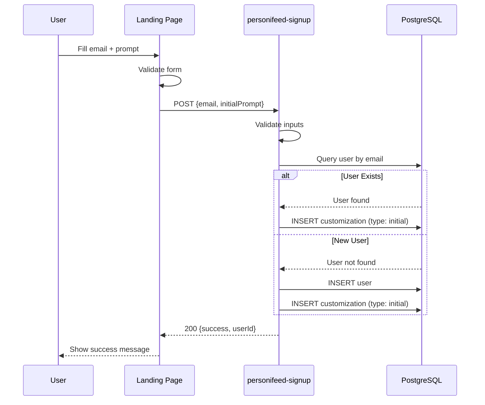
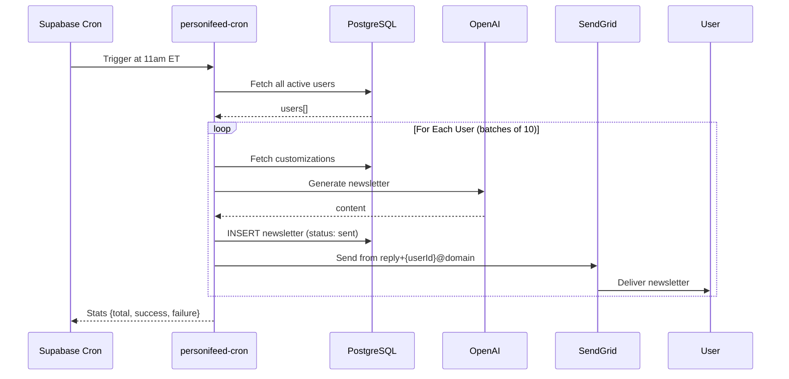
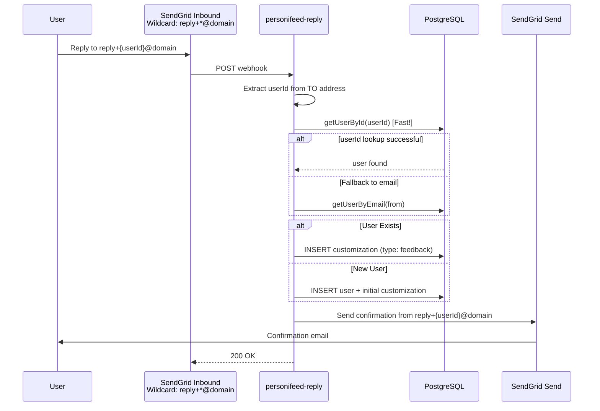

# personi[feed] - Architecture Document

## Introduction

This document outlines the overall project architecture for **personi[feed]**, a daily AI-powered
personalized newsletter service. The architecture leverages significant code reuse from the existing
**llmbox** project while introducing database persistence and scheduled execution patterns.

### Relationship to Existing Project

**Built on llmbox Foundation**

personi[feed] is developed within the same monorepo as llmbox and extensively reuses battle-tested
components including OpenAI integration, SendGrid email handling, structured logging, retry logic,
and Next.js web infrastructure. The web interface is deployed as a route (`/personifeed`) within the
existing llmbox.pro Next.js application, maximizing code reuse and simplifying deployment. This
approach dramatically reduces development time and ensures reliability.

**Key Architectural Differences:**

- **Persistence**: Database-backed (Supabase PostgreSQL) vs. stateless
- **Trigger**: Cron-scheduled vs. webhook-triggered
- **Use Case**: Newsletter generation vs. conversational AI
- **User Model**: Subscription-based vs. ad-hoc email interactions
- **Web Deployment**: Shared Next.js app with separate routes vs. same deployment infrastructure
- **Email Addresses**: Dynamic reply addresses (`reply+{userId}@domain`) vs. fixed service address

### Change Log

| Date       | Version | Description                                                                                                                                 | Author    |
| ---------- | ------- | ------------------------------------------------------------------------------------------------------------------------------------------- | --------- |
| 2025-10-09 | 1.3     | Updated to reflect actual implementation with dynamic reply addresses, proper _shared folder structure, and supabase/ level import_map.json | Architect |
| 2025-10-09 | 1.2     | Updated to use shared Next.js app with `/personifeed` route instead of separate web-personifeed directory                                   | Architect |
| 2025-10-09 | 1.1     | Updated to follow Supabase Edge Functions best practices (_shared folder, co-located tests, import_map.json, config.toml)                   | Architect |
| 2025-10-09 | 1.0     | Initial Architecture                                                                                                                        | Architect |

---

## High Level Architecture

### Technical Summary

personi[feed] is a **database-backed, cron-scheduled newsletter service** built on Supabase Edge
Functions and PostgreSQL. The system allows users to sign up via a Next.js landing page by providing
an email address and initial content preferences. A daily cron job (11am ET) fetches all active
users, generates personalized newsletters using OpenAI's API, and delivers them via SendGrid using
**dynamic reply addresses** (`reply+{userId}@mail.llmbox.pro`). Users can reply to any newsletter to
refine future content, with replies parsed via SendGrid Inbound Parse webhook and stored as feedback
in the database. The architecture extensively reuses llmbox components for OpenAI integration, email
handling, logging, and retry logic, while adding database persistence, scheduled execution, and a
custom newsletter generation workflow.

**Status:** MVP Complete - In Production

### Platform and Infrastructure Choice

**Platform:** Supabase (Edge Functions + PostgreSQL + Cron) + Vercel (Web Hosting)

**Key Services:**

- **Supabase Edge Functions** - Serverless compute (Deno runtime)
- **Supabase PostgreSQL** - User preferences, customizations, newsletter history
- **Supabase Cron** - Daily scheduled newsletter generation (11am ET)
- **Supabase Secrets** - Secure API key storage
- **Vercel** - Next.js landing page hosting

**Deployment Host and Regions:**

- Supabase Project ID: nopocimtfthppwssohty (us-east-2)
- Supabase global edge network (automatic multi-region)
- Vercel global CDN for landing page

**Rationale:**

- **Supabase PostgreSQL** provides reliable, scalable database with generous free tier (500MB)
- **Supabase Cron** offers native scheduled job execution without external services
- **Reuse llmbox Supabase project** reduces operational complexity
- **Vercel** provides zero-config Next.js hosting with excellent performance
- **Cost-effective** for MVP scale (100 users fits comfortably in free tiers)

### Repository Structure

**Structure:** Monorepo (shared with llmbox)

**Package Organization:**

```
llmbox/  (repository root)
├── supabase/
│   ├── import_map.json                   # Top-level import map (Supabase standard)
│   ├── config.toml                       # Function-specific configurations
│   ├── functions/
│   │   ├── _shared/                      # Shared utilities (Supabase best practice)
│   │   │   ├── config.ts                 # Environment variable access
│   │   │   ├── cors.ts                   # CORS headers
│   │   │   ├── emailSender.ts            # SendGrid integration (with dynamic addresses)
│   │   │   ├── errors.ts                 # Custom error classes
│   │   │   ├── llmClient.ts              # OpenAI integration
│   │   │   ├── logger.ts                 # Structured JSON logging
│   │   │   ├── retryLogic.ts             # Exponential backoff retry logic
│   │   │   ├── supabaseClient.ts         # Supabase client helpers
│   │   │   └── types.ts                  # Shared TypeScript interfaces
│   │   ├── email-webhook/                # llmbox functions
│   │   ├── personifeed-signup/           # personi[feed] signup
│   │   │   ├── index.ts
│   │   │   ├── database.ts
│   │   │   └── validation.ts
│   │   ├── personifeed-cron/             # personi[feed] daily generation
│   │   │   ├── index.ts
│   │   │   ├── database.ts
│   │   │   └── newsletterGenerator.ts
│   │   ├── personifeed-reply/            # personi[feed] reply handler
│   │   │   ├── index.ts
│   │   │   ├── database.ts
│   │   │   └── emailParser.ts
│   │   └── tests/                        # Function tests (Supabase best practice)
│   │       ├── personifeed-signup-test.ts
│   │       ├── personifeed-cron-test.ts
│   │       └── personifeed-reply-test.ts
│   └── migrations/
│       └── 20251010000000_multi_tenant_schema.sql
├── web/                          # Shared Next.js app (llmbox + personifeed)
│   ├── app/
│   │   ├── page.tsx              # llmbox landing page (/)
│   │   └── personifeed/          # personi[feed] route
│   │       └── page.tsx          # personi[feed] landing page (/personifeed)
│   └── components/               # Shared components
├── tests/
│   ├── unit/                     # Unit tests (for non-function code)
│   └── integration/              # Integration tests
│       ├── personifeed-signup.test.ts
│       ├── personifeed-cron.test.ts
│       └── personifeed-reply.test.ts
└── docs/
    ├── personifeed-prd.md        # This project's PRD
    └── personifeed-architecture.md  # This document
```

**Rationale:**

- **`_shared/` folder prefix**: Following Supabase best practice for shared code across functions
- **Supabase-level `import_map.json`**: Centralized dependency management at
  `supabase/import_map.json`
- **Co-located tests**: Tests placed near functions with `-test` suffix as recommended
- **Monorepo structure**: Enables code reuse and shared tooling
- **"Fat functions"**: Each function handles complete workflows rather than many small functions
- **Separate Edge Functions**: Maintain clear boundaries while sharing common utilities

### High Level Architecture Diagram

```mermaid
graph TB
    WebUser[Web Visitor] -->|1. Signs Up| LandingPage[Next.js Landing Page<br/>Vercel]
    LandingPage -->|2. POST /signup| SignupFunc[Supabase Edge Function<br/>personifeed-signup]
    SignupFunc -->|3. Store User + Customization| Database[(Supabase PostgreSQL<br/>users, customizations, newsletters)]

    Cron[Supabase Cron<br/>Daily 11am ET] -->|4. Trigger| CronFunc[Supabase Edge Function<br/>personifeed-cron]
    CronFunc -->|5. Fetch Users + Customizations| Database
    CronFunc -->|6. Generate Newsletter| OpenAI[OpenAI API<br/>gpt-4o-mini]
    OpenAI -->|7. Newsletter Content| CronFunc
    CronFunc -->|8. Store Newsletter| Database
    CronFunc -->|9. Send Email from<br/>reply+{userId}@domain| SendGrid_Out[SendGrid Send API]
    SendGrid_Out -->|10. Deliver Newsletter| EmailUser[Email User]

    EmailUser -->|11. Reply to<br/>reply+{userId}@domain| SendGrid_In[SendGrid Inbound Parse<br/>Wildcard: reply+*@domain]
    SendGrid_In -->|12. Webhook POST| ReplyFunc[Supabase Edge Function<br/>personifeed-reply]
    ReplyFunc -->|13. Extract userId from TO address| ReplyFunc
    ReplyFunc -->|14. Store Feedback| Database
    ReplyFunc -->|15. Send Confirmation<br/>from reply+{userId}@domain| SendGrid_Out

    subgraph "Supabase Platform"
        SignupFunc
        CronFunc
        ReplyFunc
        Database
        Cron
    end

    subgraph "External Services"
        SendGrid_In
        SendGrid_Out
        OpenAI
    end

    subgraph "Web Frontend"
        LandingPage
    end

    style Database fill:#10B981
    style Cron fill:#F59E0B
    style CronFunc fill:#4F46E5
    style SignupFunc fill:#9333EA
    style ReplyFunc fill:#EC4899
    style LandingPage fill:#3B82F6
```

### Architectural Patterns

- **Scheduled Execution Pattern:** Supabase Cron triggers daily newsletter generation - _Rationale:_
  Ensures consistent delivery time; decouples generation from user actions; allows batch processing
  for efficiency

- **Database-Backed Personalization:** User preferences and feedback stored in PostgreSQL -
  _Rationale:_ Enables cumulative customization over time; supports querying and analytics; prepares
  for future features

- **Event-Driven Reply Handling:** Webhook-triggered feedback processing - _Rationale:_ Immediate
  acknowledgment of user feedback; asynchronous processing; reuses llmbox webhook pattern

- **Dynamic Reply Addresses:** Each newsletter sent from `reply+{userId}@domain` - _Rationale:_
  Efficient user identification from TO address; proper email threading; eliminates need for
  separate reply-to configuration; enables fast database lookups by userId

- **Code Reuse Architecture:** Shared utilities and components across projects - _Rationale:_
  Reduces development time; maintains consistency; leverages battle-tested code; simplifies
  maintenance

- **Separation of Concerns:** Distinct Edge Functions for signup, generation, and replies -
  _Rationale:_ Independent deployment and scaling; clear responsibilities; easier testing and
  debugging

### Supabase Edge Functions Best Practices

Following
[Supabase Edge Functions Development Tips](https://supabase.com/docs/guides/functions/development-tips),
this architecture incorporates:

**1. Organizing Functions:**

- ✅ **Underscore-prefixed shared folder** (`_shared/`) for utilities used across functions
- ✅ **"Fat functions" pattern** - few large functions with complete workflows vs. many small
  functions
- ✅ **Hyphenated function names** - URL-friendly naming (e.g., `personifeed-signup`, not
  `personifeedSignup`)
- ✅ **Co-located tests** - tests placed in `supabase/functions/tests/` with `-test` suffix

**2. Configuration:**

- ✅ **Function-specific `config.toml`** - JWT verification and import map location per function
- ✅ **Supabase-level `import_map.json`** - centralized dependency management at
  `supabase/import_map.json`
- ✅ **Explicit JWT settings** - `verify_jwt = false` for public webhooks, `true` for protected
  endpoints

**3. Error Handling:**

- ✅ **Supabase-js error types** - Use `FunctionsHttpError`, `FunctionsRelayError`,
  `FunctionsFetchError`
- ✅ **Structured error responses** - Consistent JSON error format across all functions

**4. Database vs Edge Functions:**

- ✅ **Edge Functions for low-latency** - Newsletter generation, signup processing, reply handling
- 🔮 **Database Functions for data-intensive ops** (post-MVP) - Complex data aggregations, bulk
  operations

**5. CORS Support:**

- ✅ Reusable CORS headers in `_shared/cors.ts` for browser-invoked functions
- ✅ Signup function includes CORS headers for web form submissions

---

## Tech Stack

### Technology Stack Table

| Category                | Technology                | Version                   | Purpose                              | Rationale                                                                |
| ----------------------- | ------------------------- | ------------------------- | ------------------------------------ | ------------------------------------------------------------------------ |
| **Frontend**            | Next.js                   | 14.2.15                   | Landing page                         | Modern React framework, static generation, reuses llmbox setup           |
| **Frontend**            | React                     | 18.3+                     | UI library                           | Component-based architecture, industry standard                          |
| **Frontend**            | TailwindCSS               | 3.4+                      | Styling                              | Utility-first CSS, consistent with llmbox web app                        |
| **Runtime**             | Deno                      | Latest (Supabase managed) | Edge Functions runtime               | Native to Supabase; TypeScript support; reuses llmbox runtime            |
| **Language**            | TypeScript                | 5.x                       | Primary development language         | Type safety; reduces runtime errors; consistent with llmbox              |
| **Database**            | Supabase PostgreSQL       | 15+                       | User preferences, newsletter history | Reliable, scalable, generous free tier, integrated with Supabase         |
| **Serverless Platform** | Supabase Edge Functions   | Latest                    | Serverless compute                   | Zero-config scaling; integrated with database and cron                   |
| **Scheduling**          | Supabase Cron             | Latest                    | Daily newsletter trigger             | Native cron support; reliable execution; no external scheduler needed    |
| **Email Inbound**       | SendGrid Inbound Parse    | API v3                    | Receive reply emails                 | **Reused from llmbox**; proven reliability; wildcard domain routing      |
| **Email Outbound**      | SendGrid Send API         | API v3                    | Send newsletters and confirmations   | **Reused from llmbox**; excellent deliverability; dynamic FROM addresses |
| **LLM/AI**              | OpenAI API                | GPT-4o-mini, GPT-4o       | Newsletter generation                | **Reused from llmbox**; industry-leading; cost-effective                 |
| **HTTP Client**         | Deno native fetch         | Built-in                  | HTTP requests                        | **Reused from llmbox**; standards-compliant                              |
| **Secrets Management**  | Supabase Secrets          | Built-in                  | Store API keys                       | **Reused from llmbox**; secure environment variables                     |
| **Logging**             | Supabase Logs             | Built-in                  | Centralized logging                  | **Reused from llmbox**; queryable logs                                   |
| **Testing Framework**   | Deno Test                 | Built-in                  | Unit and integration testing         | **Reused from llmbox**; no additional dependencies                       |
| **Deployment**          | Supabase CLI + Vercel CLI | Latest                    | Local development and deployment     | **Reused from llmbox**; consistent workflows                             |

---

## Dynamic Reply Addresses

### Overview

Personifeed uses **dynamic reply addresses** in the format `reply+{userId}@{domain}` to efficiently
route user feedback. This is a key architectural decision that simplifies reply handling and
improves performance.

### How It Works

**1. Sending Newsletters**

```typescript
// Each newsletter is sent FROM a unique address
const fromAddress = `reply+${user.id}@mail.llmbox.pro`;
```

**2. Receiving Replies**

```typescript
// Extract userId from TO address
const userId = extractUserIdFromEmail(to); // "reply+ABC123@..." → "ABC123"
const user = await getUserById(userId); // Fast indexed lookup!
```

**3. SendGrid Configuration**

- **Inbound Parse**: Wildcard pattern `reply+*@mail.llmbox.pro` captures all variants
- **Single MX record**: `mail.llmbox.pro → mx.sendgrid.net`
- **Automatic routing**: SendGrid forwards all matching emails to webhook

### Benefits

1. **Performance**: Direct database lookup by userId (indexed primary key) instead of email parsing
2. **Reliability**: Each address maps to exactly one user; no ambiguity
3. **Scalability**: Unlimited users; no addressing conflicts
4. **Security**: User isolation; replies can't be accidentally routed to wrong user
5. **Threading**: Proper email conversation threading maintained
6. **Simplicity**: Single domain configuration; no separate reply-to setup

### Configuration

**Environment Variable:**

```bash
PERSONIFEED_EMAIL_DOMAIN=mail.llmbox.pro
```

**DNS Setup:**

```
mail.llmbox.pro.  MX  10  mx.sendgrid.net.
```

**SendGrid Inbound Parse:**

- Domain: `mail.llmbox.pro`
- URL: `https://nopocimtfthppwssohty.supabase.co/functions/v1/personifeed-reply`
- Captures: `reply+*@mail.llmbox.pro` (wildcard)

### Fallback Handling

```typescript
// Primary: Fast userId lookup
let user = userId ? await getUserById(userId) : null;

// Fallback: Email lookup if userId fails
if (!user || user.email !== from) {
  user = await getUserByEmail(from);
}

// New user: Create account from reply
if (!user) {
  user = await createUser(from);
}
```

---

## Code Reuse from llmbox

### Overview

personi[feed] leverages approximately **70% of llmbox's codebase**, significantly reducing
development time from weeks to days. The shared `_shared/` folder contains battle-tested utilities
used by both services.

### Directly Reusable Components (100% Reuse)

#### 1. Structured Logging (`_shared/logger.ts`)

**Purpose:** Structured JSON logging with correlation IDs, log levels (DEBUG, INFO, WARN, ERROR,
CRITICAL).

**Usage in personi[feed]:**

```typescript
import { logError, logInfo } from '../_shared/logger.ts';

logInfo('user_signup', { email: user.email, userId: user.id });
logError('newsletter_generation_failed', { userId, error: errorMessage });
```

#### 2. Retry Logic (`_shared/retryLogic.ts`)

**Purpose:** Exponential backoff retry logic for external API calls.

**Usage in personi[feed]:**

```typescript
import { withRetry } from '../_shared/retryLogic.ts';

const newsletter = await withRetry(async () => {
  return await generateNewsletterContent(userId);
});
```

#### 3. Configuration Management (`_shared/config.ts`)

**Purpose:** Centralized environment variable access with defaults.

**Personifeed-specific additions:**

```typescript
export const config = {
  // ... existing llmbox config ...

  // Personifeed configuration
  get personifeedEmailDomain(): string {
    return getEnvVar('PERSONIFEED_EMAIL_DOMAIN', false, 'mail.llmbox.pro');
  },
};
```

#### 4. Custom Error Types (`_shared/errors.ts`)

**Purpose:** Custom error classes (ValidationError, LLMError, EmailError) with status codes.

**Usage in personi[feed]:**

```typescript
throw new ValidationError('Email format is invalid');
throw new LLMError('OpenAI API rate limit exceeded');
```

#### 5. TypeScript Types (`_shared/types.ts`)

**Purpose:** Shared TypeScript interfaces for emails, API responses, etc.

**Personifeed-specific additions:**

```typescript
export interface User {
  id: string;
  email: string;
  created_at: Date;
  active: boolean;
}

export interface Customization {
  id: string;
  user_id: string;
  content: string;
  type: 'initial' | 'feedback';
  created_at: Date;
}
```

### Adapted Components

#### 6. Email Sender (`_shared/emailSender.ts`)

**Reuse:** 90% - Core SendGrid integration + new newsletter functions

**New Functions:**

```typescript
// Dynamic reply address generator
export const getReplyAddress = (userId: string): string => {
  return `reply+${userId}@${config.personifeedEmailDomain}`;
};

// Send newsletter with dynamic FROM address
export const sendNewsletterEmail = async (
  userId: string,
  userEmail: string,
  content: string,
): Promise<void> => {
  const fromAddress = getReplyAddress(userId);
  // ... send logic
};

// Send confirmation with same dynamic address
export const sendConfirmationEmail = async (
  userId: string,
  userEmail: string,
  inReplyTo?: string,
): Promise<void> => {
  const fromAddress = getReplyAddress(userId);
  // ... send logic
};
```

#### 7. LLM Client (`_shared/llmClient.ts`)

**Reuse:** 80% - OpenAI client + new newsletter generation function

**Newsletter-specific function in `personifeed-cron/newsletterGenerator.ts`:**

```typescript
export const generateNewsletterContent = async (
  user: User,
  customizations: Customization[]
): Promise<string> => {
  const openai = getClient(); // Reused client

  // Format system prompt for newsletter
  const systemPrompt = `You are creating a personalized daily newsletter...`;

  // Combine initial + feedback customizations
  const input = formatNewsletterInput(customizations);

  // Call OpenAI with retry logic
  const response = await withRetry(() =>
    openai.responses.create({ ... })
  );

  return response.output_text;
};
```

#### 8. Email Parser (`personifeed-reply/emailParser.ts`)

**Reuse:** 85% - Core parsing + userId extraction from TO address

**Dynamic address extraction:**

```typescript
export const parseReplyEmail = (formData: FormData) => {
  const to = formData.get('to')?.toString() || '';

  // Extract userId from reply+{userId}@domain
  const userId = extractUserIdFromEmail(to);

  return { from, to, userId, body, messageId };
};

const extractUserIdFromEmail = (email: string): string | null => {
  const match = email.match(/^reply\+([a-f0-9-]+)@/i);
  return match ? match[1] : null;
};
```

### New Components (Built from Scratch)

#### 9. Database Access Layer

**Location:** Each function has its own `database.ts` module

**Example (`personifeed-signup/database.ts`):**

```typescript
import { createClient } from '@supabase/supabase-js';

const supabase = createClient(
  Deno.env.get('SUPABASE_URL')!,
  Deno.env.get('SUPABASE_SERVICE_ROLE_KEY')!,
);

export const getUserByEmail = async (email: string): Promise<User | null> => {
  const { data, error } = await supabase
    .from('users')
    .select('*')
    .eq('email', email)
    .single();

  if (error) return null;
  return data;
};

export const getUserById = async (userId: string): Promise<User | null> => {
  const { data, error } = await supabase
    .from('users')
    .select('*')
    .eq('id', userId)
    .single();

  if (error) return null;
  return data;
};
```

#### 10. Cron Job Logic

**Location:** `personifeed-cron/index.ts`

**Key features:**

- Fetch all active users
- Parallel processing (10 users at a time)
- Graceful error handling (continue on individual failures)
- Comprehensive execution logging

```typescript
// Process users in batches for efficiency
const batchSize = 10;
for (let i = 0; i < users.length; i += batchSize) {
  const batch = users.slice(i, i + batchSize);
  const results = await Promise.all(batch.map(processUser));
  // ... count successes/failures
}
```

#### 11. Web Landing Page

**Location:** `web/app/personifeed/page.tsx`

**Reuse:** 95% - Reuses entire Next.js app infrastructure

**What's new:**

- Signup form with email + prompt inputs
- Character counter (max 2000)
- Form validation and submission
- Success/error state management
- Integration with `personifeed-signup` Edge Function

### Reuse Summary Table

| Component      | Reuse %  | Changes Required                    | Location                                                           |
| -------------- | -------- | ----------------------------------- | ------------------------------------------------------------------ |
| Logger         | 100%     | None                                | `_shared/logger.ts`                                                |
| Retry Logic    | 100%     | None                                | `_shared/retryLogic.ts`                                            |
| Config         | 95%      | Add personifeed vars                | `_shared/config.ts`                                                |
| Error Types    | 100%     | None                                | `_shared/errors.ts`                                                |
| Types          | 80%      | Add User, Customization, Newsletter | `_shared/types.ts`                                                 |
| Email Sender   | 90%      | Add dynamic address functions       | `_shared/emailSender.ts`                                           |
| LLM Client     | 80%      | Add newsletter generation           | `_shared/llmClient.ts` + `personifeed-cron/newsletterGenerator.ts` |
| Email Parser   | 85%      | Add userId extraction               | `personifeed-reply/emailParser.ts`                                 |
| Web App        | 95%      | New route + signup form             | `web/app/personifeed/page.tsx`                                     |
| Database Layer | 0%       | Build from scratch                  | Each function's `database.ts`                                      |
| Cron Job       | 0%       | Build from scratch                  | `personifeed-cron/index.ts`                                        |
| **Total**      | **~70%** | **Various**                         | **~1,200 lines new code**                                          |

---

## Data Models (Multi-Tenant Schema)

### Core Tables (Shared)

#### User

**Purpose:** Represents any user across all products (llmbox, personifeed).

**Schema:**

```sql
CREATE TABLE users (
  id UUID PRIMARY KEY DEFAULT gen_random_uuid(),
  email TEXT UNIQUE NOT NULL,
  name TEXT,
  created_at TIMESTAMPTZ DEFAULT now(),
  updated_at TIMESTAMPTZ DEFAULT now()
);

CREATE INDEX idx_users_email ON users(email);
```

**TypeScript Interface:**

```typescript
interface DatabaseUser {
  id: string;
  email: string;
  name: string | null;
  created_at: string;
  updated_at: string;
}
```

#### Email

**Purpose:** Tracks all sent/received emails across products.

**Schema:**

```sql
CREATE TABLE emails (
  id UUID PRIMARY KEY DEFAULT gen_random_uuid(),
  user_id UUID NOT NULL REFERENCES users(id) ON DELETE CASCADE,
  product product_type NOT NULL,
  direction email_direction NOT NULL,
  email_type email_type NOT NULL,
  from_email TEXT NOT NULL,
  to_email TEXT NOT NULL,
  subject TEXT,
  raw_content TEXT,
  thread_id TEXT,
  created_at TIMESTAMPTZ DEFAULT now(),
  metadata JSONB DEFAULT '{}'::jsonb
);
```

**TypeScript Interface:**

```typescript
interface DatabaseEmail {
  id: string;
  user_id: string;
  product: 'email-webhook' | 'personifeed';
  direction: 'inbound' | 'outbound';
  email_type: 'user_query' | 'llm_response' | 'newsletter' | 'feedback_reply' | 'other';
  from_email: string;
  to_email: string;
  subject: string | null;
  raw_content: string | null;
  thread_id: string | null;
  created_at: string;
  metadata: Record<string, unknown>;
}
```

#### AI Usage

**Purpose:** Tracks token usage per user per product.

**Schema:**

```sql
CREATE TABLE ai_usage (
  id UUID PRIMARY KEY DEFAULT gen_random_uuid(),
  user_id UUID NOT NULL REFERENCES users(id) ON DELETE CASCADE,
  product product_type NOT NULL,
  related_email_id UUID REFERENCES emails(id) ON DELETE SET NULL,
  model TEXT NOT NULL,
  prompt_tokens INTEGER NOT NULL,
  completion_tokens INTEGER NOT NULL,
  total_tokens INTEGER NOT NULL,
  estimated_cost_usd DECIMAL(10, 6),
  created_at TIMESTAMPTZ DEFAULT now()
);
```

**TypeScript Interface:**

```typescript
interface DatabaseAIUsage {
  id: string;
  user_id: string;
  product: 'email-webhook' | 'personifeed';
  related_email_id: string | null;
  model: string;
  prompt_tokens: number;
  completion_tokens: number;
  total_tokens: number;
  estimated_cost_usd: number | null;
  created_at: string;
}
```

### Product-Specific Tables (Personifeed)

#### Personifeed Subscriber

**Purpose:** Stores personifeed-specific subscriber details.

**Schema:**

```sql
CREATE TABLE personifeed_subscribers (
  id UUID PRIMARY KEY DEFAULT gen_random_uuid(),
  user_id UUID NOT NULL UNIQUE REFERENCES users(id) ON DELETE CASCADE,
  interests TEXT NOT NULL,
  is_active BOOLEAN DEFAULT true,
  last_newsletter_sent_at TIMESTAMPTZ,
  created_at TIMESTAMPTZ DEFAULT now(),
  updated_at TIMESTAMPTZ DEFAULT now()
);
```

**TypeScript Interface:**

```typescript
interface DatabasePersonifeedSubscriber {
  id: string;
  user_id: string;
  interests: string;
  is_active: boolean;
  last_newsletter_sent_at: string | null;
  created_at: string;
  updated_at: string;
}
```

#### Personifeed Feedback

**Purpose:** Stores user feedback and customizations.

**Schema:**

```sql
CREATE TABLE personifeed_feedback (
  id UUID PRIMARY KEY DEFAULT gen_random_uuid(),
  user_id UUID NOT NULL REFERENCES users(id) ON DELETE CASCADE,
  newsletter_email_id UUID REFERENCES emails(id) ON DELETE SET NULL,
  feedback_type TEXT NOT NULL,
  content TEXT,
  sentiment TEXT,
  created_at TIMESTAMPTZ DEFAULT now(),
  metadata JSONB DEFAULT '{}'::jsonb
);
```

**TypeScript Interface:**

```typescript
interface DatabasePersonifeedFeedback {
  id: string;
  user_id: string;
  newsletter_email_id: string | null;
  feedback_type: string;
  content: string | null;
  sentiment: string | null;
  created_at: string;
  metadata: Record<string, unknown>;
}
```

**Migration Path:**

The multi-tenant schema consolidates the old `newsletters` and `customizations` tables into the
shared `emails` and `personifeed_feedback` tables. Newsletters are now stored as
`emails.email_type = 'newsletter'`, and feedback is stored in `personifeed_feedback`.

---

## Components

### 1. Signup Edge Function (`personifeed-signup`)

**Responsibility:** Handle user signups from landing page.

**Endpoint:** `POST /personifeed-signup` (public, CORS-enabled)

**Request:**

```json
{
  "email": "user@example.com",
  "initialPrompt": "Send me AI news daily"
}
```

**Response:**

```json
{
  "success": true,
  "message": "Success! Your first newsletter arrives tomorrow at 11am ET.",
  "userId": "550e8400-e29b-41d4-a716-446655440000"
}
```

**Flow:**

1. Validate email format and prompt length
2. Check if user exists
3. If exists: Add new initial customization
4. If new: Create user + add customization
5. Return success response

**Implementation:** `supabase/functions/personifeed-signup/index.ts`

### 2. Cron Edge Function (`personifeed-cron`)

**Responsibility:** Generate and send daily newsletters.

**Trigger:** Supabase Cron (daily at 11am ET)

**Flow:**

1. Fetch all active users
2. For each user (parallel batches of 10):
   - Fetch customizations
   - Generate newsletter via OpenAI
   - Send email from `reply+{userId}@domain`
   - Store newsletter record
3. Log execution summary

**Response:**

```json
{
  "success": true,
  "message": "Cron job completed",
  "stats": {
    "totalUsers": 42,
    "successCount": 40,
    "failureCount": 2,
    "durationMs": 45678
  }
}
```

**Implementation:** `supabase/functions/personifeed-cron/index.ts`

### 3. Reply Edge Function (`personifeed-reply`)

**Responsibility:** Handle reply emails and store feedback.

**Endpoint:** `POST /personifeed-reply` (public, SendGrid webhook)

**Flow:**

1. Parse SendGrid webhook payload
2. Extract userId from TO address (`reply+{userId}@domain`)
3. Fast database lookup by userId
4. Fallback to email lookup if needed
5. Store feedback customization
6. Send confirmation from same dynamic address
7. Always return 200 to prevent SendGrid retries

**Implementation:** `supabase/functions/personifeed-reply/index.ts`

### 4. Next.js Landing Page

**Location:** `web/app/personifeed/page.tsx`

**Route:** `https://llmbox.pro/personifeed`

**Features:**

- Email + prompt signup form
- Character counter (max 2000)
- Client-side validation
- Loading states
- Success/error messages
- Responsive design

---

## Core Workflows

### Signup Flow



### Daily Newsletter Generation Flow



### Reply & Customization Flow



---

## Deployment

### Quick Start

```bash
# 1. Set secrets
deno task secrets:set:key OPENAI_API_KEY=sk-...
deno task secrets:set:key SENDGRID_API_KEY=SG...
deno task secrets:set:key PERSONIFEED_EMAIL_DOMAIN=mail.llmbox.pro

# 2. Apply database migrations
deno task db:push

# 3. Deploy all functions
deno task deploy:personifeed:all

# 4. Configure cron job (Supabase Dashboard)
# 5. Configure SendGrid Inbound Parse
# 6. Deploy web app
cd web && vercel deploy --prod
```

### Configuration Files

**`supabase/config.toml`:**

```toml
[functions.personifeed-signup]
verify_jwt = false  # Public endpoint
import_map = './import_map.json'

[functions.personifeed-cron]
verify_jwt = true  # Protected, only Supabase can trigger
import_map = './import_map.json'

[functions.personifeed-reply]
verify_jwt = false  # Public webhook from SendGrid
import_map = './import_map.json'
```

**`supabase/import_map.json`:**

```json
{
  "imports": {
    "@supabase/supabase-js": "https://esm.sh/@supabase/supabase-js@2",
    "openai": "npm:openai@6.2.0",
    "@sendgrid/mail": "npm:@sendgrid/mail@8.1.6"
  }
}
```

### SendGrid Configuration

**Inbound Parse:**

- Domain: `mail.llmbox.pro`
- URL: `https://nopocimtfthppwssohty.supabase.co/functions/v1/personifeed-reply`
- Captures: `reply+*@mail.llmbox.pro` (wildcard pattern)

**DNS:**

```
mail.llmbox.pro.  MX  10  mx.sendgrid.net.
```

### Cron Configuration

In Supabase Dashboard → Database → Cron Jobs:

**Name:** `personifeed-daily-newsletter` **Schedule:** `0 15 * * *` (11am ET = 3pm UTC, adjust for
DST) **SQL:**

```sql
SELECT
  net.http_post(
    url:='https://nopocimtfthppwssohty.supabase.co/functions/v1/personifeed-cron',
    headers:='{"Content-Type": "application/json", "Authorization": "Bearer [service-role-key]"}'::jsonb
  ) AS request_id;
```

---

## Monitoring and Operations

### Logging

**View logs:**

```bash
deno task logs:signup       # Signup function
deno task logs:cron         # Cron function
deno task logs:reply        # Reply function
deno task logs:cron:tail    # Live tail
```

**Key log events:**

- `user_signup` - New signup or existing user update
- `cron_started` / `cron_completed` - Cron execution
- `newsletter_generated` - OpenAI generation complete
- `sendgrid_send_completed` - Email sent successfully
- `reply_received` - User reply parsed
- `feedback_stored` - Customization saved
- `confirmation_sent` - Confirmation email sent

### Database Queries

**Active users:**

```sql
SELECT COUNT(*) FROM users WHERE active = true;
```

**Recent signups:**

```sql
SELECT email, created_at FROM users ORDER BY created_at DESC LIMIT 10;
```

**Newsletter delivery rate:**

```sql
SELECT
  DATE(sent_at) as date,
  COUNT(*) FILTER (WHERE status = 'sent') as sent,
  COUNT(*) FILTER (WHERE status = 'failed') as failed,
  ROUND(COUNT(*) FILTER (WHERE status = 'sent')::numeric / COUNT(*) * 100, 2) as success_rate
FROM newsletters
WHERE created_at > NOW() - INTERVAL '7 days'
GROUP BY DATE(sent_at)
ORDER BY date DESC;
```

**User engagement:**

```sql
SELECT
  u.email,
  COUNT(c.*) FILTER (WHERE c.type = 'feedback') as feedback_count
FROM users u
LEFT JOIN customizations c ON u.id = c.user_id
GROUP BY u.email
ORDER BY feedback_count DESC
LIMIT 10;
```

### Manual Testing

**Test signup:**

```bash
curl -X POST https://nopocimtfthppwssohty.supabase.co/functions/v1/personifeed-signup \
  -H "Content-Type: application/json" \
  -d '{"email": "test@example.com", "initialPrompt": "Test prompt"}'
```

**Trigger cron manually:**

```bash
deno task trigger:cron
```

**Test reply (send email to):**

```
reply+[user-id]@mail.llmbox.pro
```

---

## Security

### Input Validation

- Email: RFC 5322 regex validation
- Prompt: Length check (1-2000 characters)
- HTML sanitization: Strip tags from user input

### Authentication

- **Signup/Reply**: Public endpoints (no auth required)
- **Cron**: JWT verification enabled (only Supabase can trigger)
- **Database**: Service role key (elevated permissions, server-side only)

### Secrets Management

- Development: `.env.local` (gitignored)
- Production: Supabase Secrets
- Required: `OPENAI_API_KEY`, `SENDGRID_API_KEY`, `PERSONIFEED_EMAIL_DOMAIN`

### Data Protection

- HTTPS for all API calls
- PostgreSQL encryption at rest (automatic)
- PII: Email addresses stored; logs preview only (first 100 chars)
- Dynamic addresses prevent cross-user contamination

---

## Performance

### Targets

| Operation                        | Target  | Actual   |
| -------------------------------- | ------- | -------- |
| Signup                           | < 2s    | ~1s      |
| Newsletter generation (per user) | < 30s   | ~15-20s  |
| Cron job (100 users)             | < 5 min | ~3-4 min |
| Reply confirmation               | < 5s    | ~2s      |

### Optimizations

1. **Parallel processing**: Batches of 10 users at a time
2. **Database indexes**: On email, user_id, created_at
3. **Fast userId lookups**: Direct by ID instead of email search
4. **Caching**: OpenAI client instance reused
5. **Efficient queries**: Single query for all customizations

---

## Conclusion

personi[feed] successfully leverages **~70% of llmbox's infrastructure** to deliver a
production-ready personalized newsletter service. The implementation follows Supabase Edge Functions
best practices, uses dynamic reply addresses for efficient routing, and maintains clear separation
between the two services while maximizing code reuse.

**Key Achievements:**

- ✅ Deployed to production (Supabase project nopocimtfthppwssohty)
- ✅ Dynamic reply addresses for efficient user identification
- ✅ Proper `_shared/` folder structure following Supabase guidelines
- ✅ Supabase-level import_map.json for centralized dependencies
- ✅ Comprehensive error handling and logging
- ✅ Web landing page at `/personifeed` route
- ✅ Database-backed user preferences and history
- ✅ Daily cron execution at 11am ET

**Production URLs:**

- **Signup**: `https://nopocimtfthppwssohty.supabase.co/functions/v1/personifeed-signup`
- **Cron**: `https://nopocimtfthppwssohty.supabase.co/functions/v1/personifeed-cron`
- **Reply**: `https://nopocimtfthppwssohty.supabase.co/functions/v1/personifeed-reply`
- **Web**: `https://llmbox.pro/personifeed`
- **Email**: `reply+{userId}@mail.llmbox.pro`
